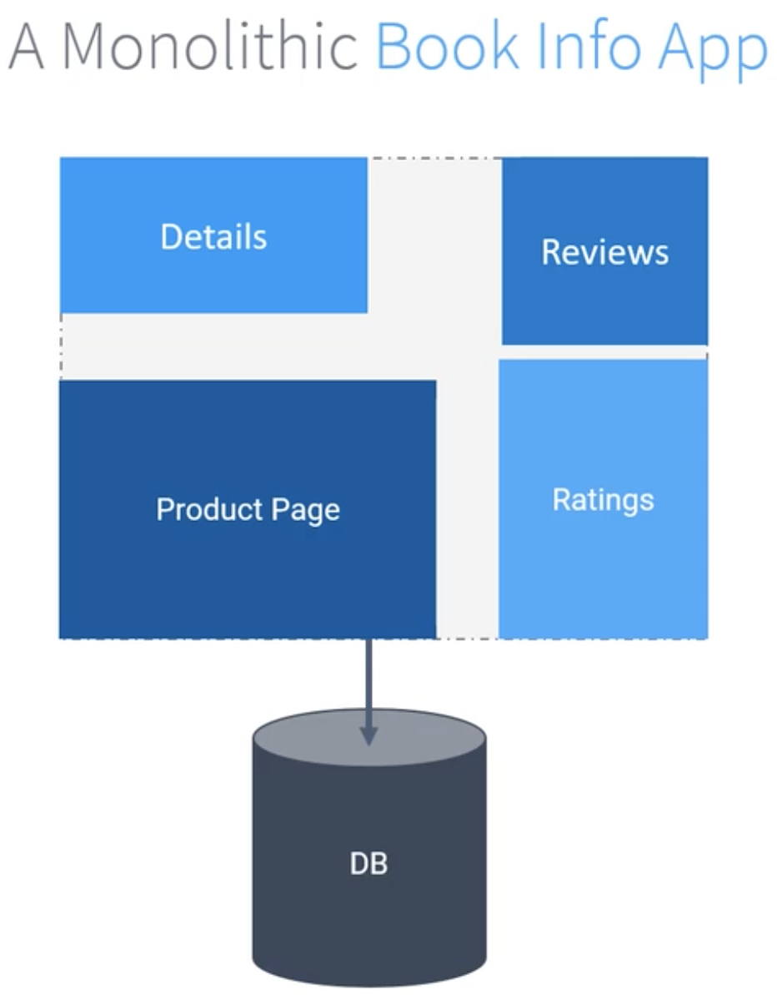
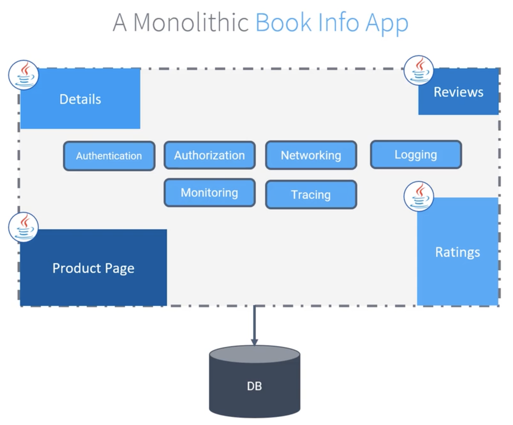

Перед погружением в Service Mesh и Istio давайте посмотрим на эволюционные изменения в проектировании ПО за последние два десятилетия.

В 2000-х годах разработка ПО стала сильно ориентированной на процесс и медленной. Для некоторых индустрий, например для оборонки и авиации, это занимало почти 20 лет. Существовал огромный временной разрыв между необходимостью возникновения ПО и его окончательной доставкой. Бизнес успевал измениться еще до того, пока программные продукты были реализованы. Многие проекты были прекращены еще до их завершения. Было потрачено очень много денег. И владельцы бизнеса и IT-специалисты были расстроены.

В 2001-м году 17 независимых специалистов по программному обеспечению собрались вместе и опубликовали Agile манифест. Они рассказали миру, что имеющийся способ создания ПО имеет основные недостатки и нуждается в изменении.

Исходя из имеющегося у них опыта, они решили, что важнее:
- ценить людей и взаимодействие выше процессов и инструментов,
- работающее ПО, чем исчерпывающая документация,
- сотрудничество с клиентами, чем переговоры по контракту,
- реагирование на изменения, чем следование плану.

Основываясь на Agile практике, мы не только больше сотрудничаем с клиентами, но также развиваем наши бизнес-модели и ПО на основе реальных экспериментов.

Когда вы работаете над одним большим приложением, если что-то ломается, то ломается целиком.

Однако, если бы вы меняли небольшие кусочки приложения, то все было бы под контролем. Кусок, над которым вы экспериментируете, может быть затронут, но риск будет меньше, чем прежде.

Так мы начали проектировать приложения все более и более маленькими, чтобы была возможность изолировать риски в процессе экспериментов, а также для более быстрого и частого деплоя.

Гигантские системы, которые мы разрабатывали, становились одной большой проблемой на пути к инновациям и гибкости. Мы должны были взглянуть на традиционную архитектуру ПО и переработать ее.

Термин "монолитный" используется, когда весь функционал приложения необходимо разворачивать одновременно и существует единый подход ко всем отдельным функциональным возможностям в рамках монолитных границ. Все функциональности как правило используют единую кодовую базу и нет четких границ между ними. Эти кусочки тесно связаны. Весь код даже может работать как один процесс. В этой модели обычно используется единая БД для persistance, которая в определенный момент становится "бутылочным горлышком".

Давайте посмотрим как работает "монолит" в реальном приложении. Здесь представлено приложение "Book Info App". Мы будем использовать его в качестве примера в этом курсе. Оно состоит из четырех разных модулей - Details, Reviews, Ratings, Product Page. Это модульное приложение, но все еще монолитное. Все сервисы зависят от определенной версии друг друга. Вам нужно развернуть весь пакет и возможно выполнить несколько скриптов в БД.

 

Страница продукта отображает информацию о книгах, обзоры и рейтинги. Все данные приложения приходят из разных модулей. Но эти модули не спроектированы по отдельности и не могут быть масштабированы.

Давайте попробуем понять зависимости модулей и проблемы монолитного приложения "Book Info App". Клиент попадает на страницу продукта.

Страница продукта получает информацию от модулей Reviews и Details.

Сервис Reviews получает количество рейтингов от сервиса Ratings.

Все они написаны на одном и том же языке - Java.

Кроме этих модулей приложение также "заботится" о сетевом взаимодействии, аутентификации, правилах авторизации, мониторинге, логировании, трассировке, каким образом данные передаются между модулями и т.д.

 

Время от времени модуль Ratings из-за количества данных испытывает проблемы и это влияет на всю систему.

Невозможно масштабировать только модуль Ratings или убрать его из системы без вмешательства в код и переразвертывания приложения.

Сейчас разрабатывается новый модуль Campaign и под него была сформирована новая команда, которая хочет использовать другой язык при разработке.