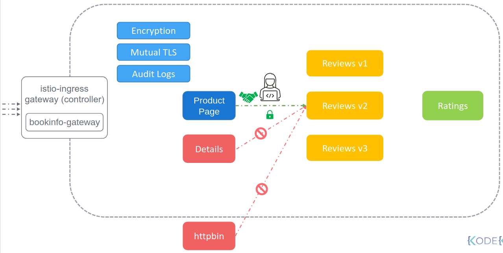

Микросервисы имеют определенные требования к безопасности. Когда один сервис взаимодействует с другим, то для атакующего существует возможность перехватить трафик и изменить его до того, как запрос дойдет до адреса назначения. Это известно как атака "Man in the middle".

Для предотвращения подобной атаки трафик между сервисами должен быть зашифрован. Во-вторых для определенных сервисов может потребоваться введение ограничений по спискам контроля доступа. Например, чтобы только сервису Product Page было разрешено подключаться к сервису Reviews и не разрешено сервису Details или каким-либо другим сервисам в кластере. Для этого нам нужен контроль доступа.

 

Istio позволяет делать это с помощью mTLS и детальными политиками доступа.

И наконец мы хотим знать, кто что делал и в какое время. И для этого Istio обеспечивает поддержку логов аудита.