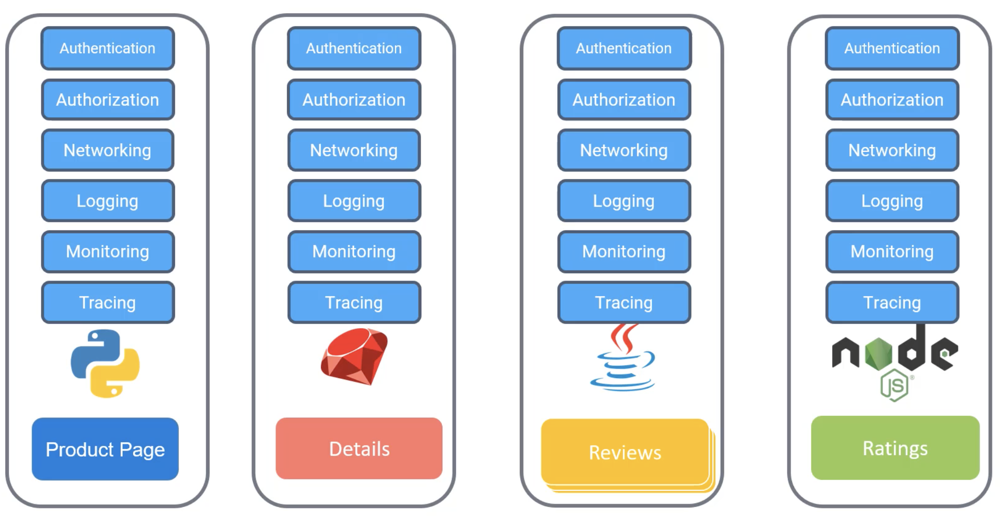
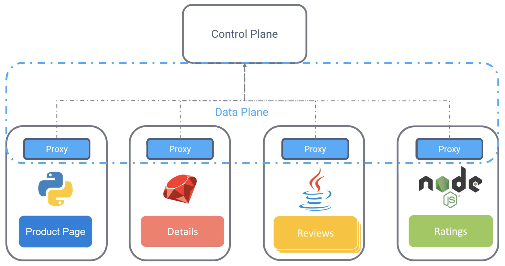
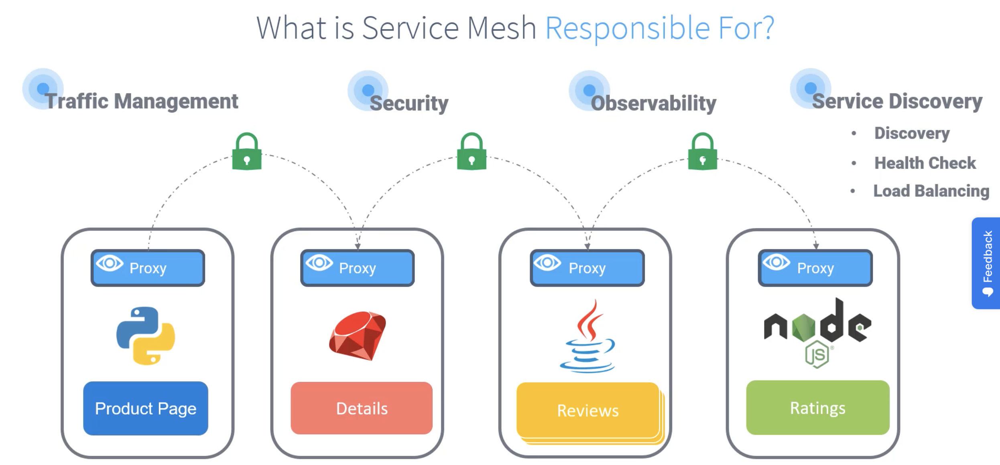

Что такое Service Mesh?

Вернемся к слайду с предыдущего урока.

 

Вместо множества различных требований к каждому микросервису, мы заменим их на единый proxy в формате sidecar-контейнера. Proxy взаимодействуют друг с другом через так называемый data plane, а также с серверными компонентами, называемыми control plane.

Control plane управляет всем входящим и исходящим трафиком ваших сервисов через proxy. Таким образом вся сетевая логика отделена от бизнес кода приложения. Такой подход известен как Service Mesh.

 

Service Mesh - это выделенный и настраиваемый инфраструктурный слой, который поддерживает взаимодействие между сервисами без необходимости изменения кода в микросервисной архитектуре.

С Service Mesh вы можете динамически конфигурировать каким образом сервисы общаются друг с другом. Когда сервисы общаются друг с другом, используется mutual TLS. Таким образом ваша рабочая нагрузка может быть безопасна.

Вы можете улучшить свое observability (видение). Например каким образом приложение выполняет end-to-end, где имеет проблемы и узкие места.

И наконец Service Discovery, которое покрывает три главных темы.

 

Discovery - в динамическом кластере нам нужно знать на каком IP и порту выставлены сервисы, чтобы они могли найти друг друга.

Health Checks помогают вам динамически поддерживать работающие в Mesh сервисы, в то время как неработающие сервисы не учитываются.

Load Balancing маршрутизирует трафик к здоровым экземплярам и отрезает его от failed экземпляров.