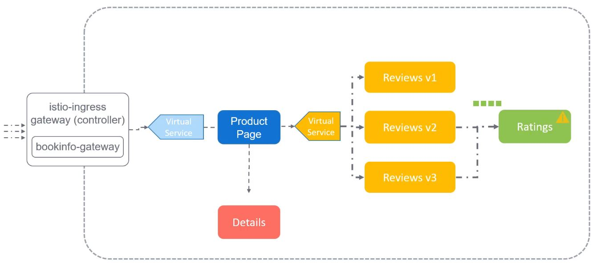

Так как каждый сервис в нашей микросервисной архитектуре является software, то мы должны ожидать, что они могут замедлиться, упасть или даже сойти с ума без видимых на то причин. Так как все сервисы зависят один от другого, замедление в работе одного, может повлиять на другие, зависящие от него. Даже может возникнуть каскадный эффект.

 

Например, если сервис Ratings начнет тормозить по каким-либо причинам, то запросы на него начнут скапливаться в очередь, что в свою очередь вызовет очередь запросов на сервис Reviews.

Или представим, что сервис Details начал тормозить. Запросы, идущие от Product Page к сервису Details, начинают скапливаться в очередь и в итоге запросы к самой Product Page также встают в очередь, и это влияет на всех пользователей приложения. Поэтому нам нужны таймауты.

Если сервису требуется слишком много времени для ответа, то он не должен удерживать другие зависимые сервисы в постоянном ожидании. Он должен падать после некоторого периода времени и возвращать сообщение об ошибке. При таком подходе зависимые сервисы получают сообщение об ошибке и не попадают под влияние. Это и есть таймаут.

Мы можем настроить таймаут либо для сервиса Details, чтобы падал он, либо мы можем настроить таймаут для сервиса Product Page, чтобы он падал быстрее, чем вечно ждать ответа от сервиса Details.

Ниже представлены сервис `details` и сервис `bookinfo`, который направляет трафик к Product Page.