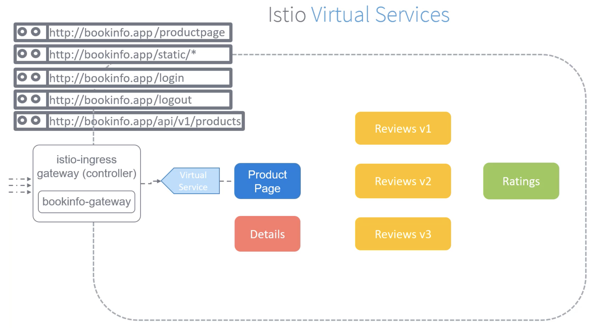
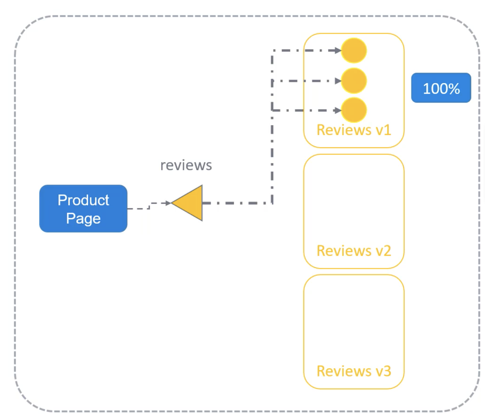
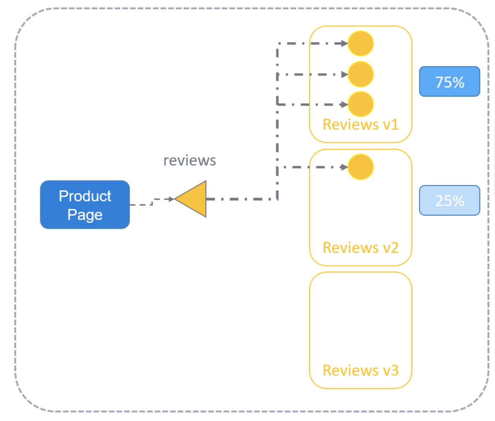
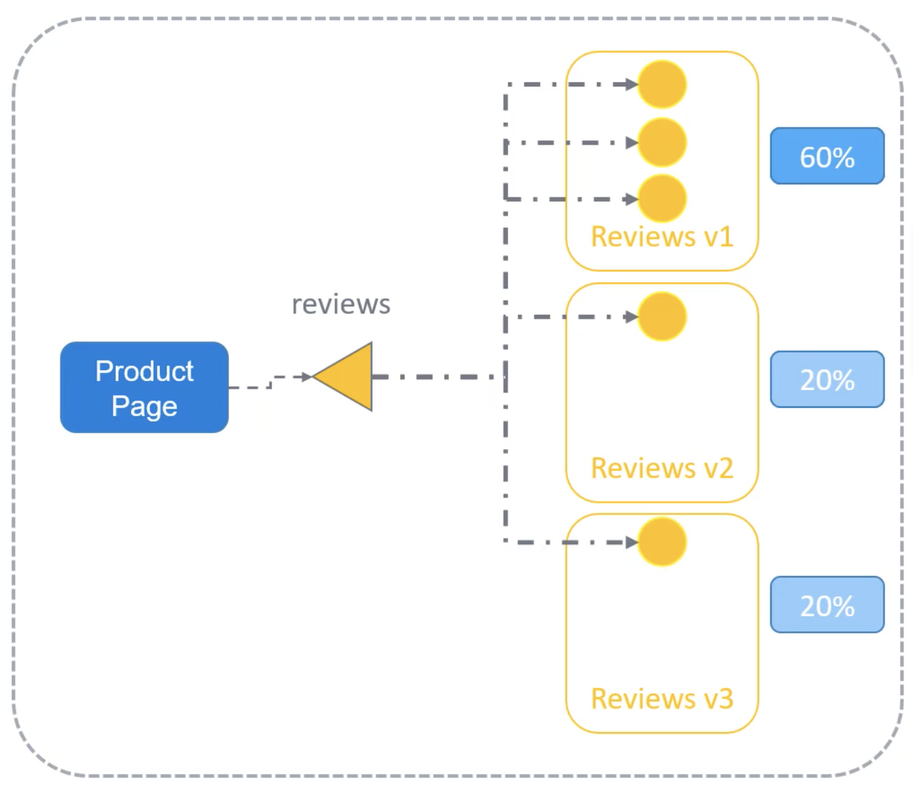
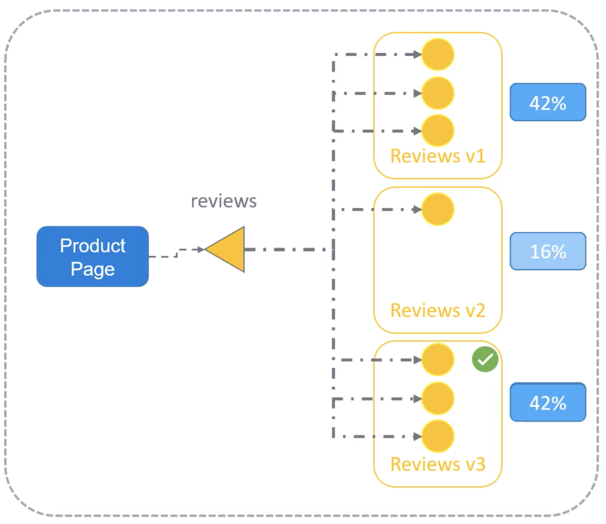
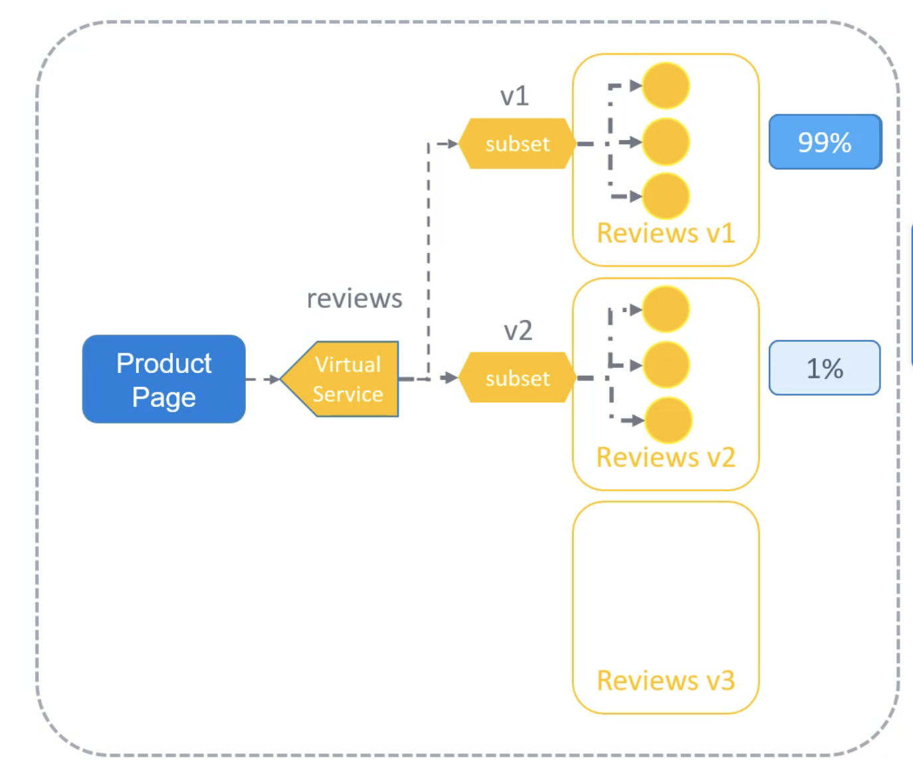

Теперь, когда нас есть Gateway `bookinfo-gateway`, пользователи, идущие на URL http://bookinfo.app, будут попадать на Gateway. Но куда идти дальше? Как мы будем маршрутизировать трафик через этот Gateway к нашим сервисам? Существует множество разных сервисов. Каким образом мы можем указать, что трафик к URL http://bookinfo.app/productpage должен идти на Service `productpage`?

Service `productpage` также обслуживает статический HTML/CSS и JavaScript контент по пути `/static`. Также существуют пути `/login`, `/logout` и `/api`. Все они должны маршрутизироваться на Service `productpage`.

Все правила маршрутизации конфигурируются с помощью Virtual Services. Virtual Services определяют набор правил маршрутизации для трафика приходящего в Service Mesh от `ingressgateway`. Virtual Services являются гибкими и мощными и обладают богатым набором опций для маршрутизации трафика. Вы можете задать поведение трафика для одного и более hostname, управлять трафиком в пределах разных версий сервиса, поддерживаются стандартные и regex-пути.

Когда Virtual Service создан, Istio control plane применяет новую конфигурацию ко всем Envoy sidecar proxies.

<br>

Давайте создадим Virtual Service для маршрутизации указанных URL к Service `productpage`. Мы создаем объект с версией API равной `networking.istio.io/v1alpha3`. Это может поменяться в последующих версиях. Поэтому всегда обращайтесь к документации Istio при создании Virtual Services для получения самой свежей поддерживаемой версии API.

Первым делом мы указываем, чтобы только трафик для хоста `bookinfo.app` попадал на Virtual Service. Для этого редактируем секцию `hosts`. Также здесь может быть настроено несколько Gateways. Каким образом мы можем ассоциировать этот Virtual Service с Gateway, созданным для нашего приложения? Для этого мы добавляем секцию `gateways` и указываем имя созданного нами Gateway - `bookinfo-gateway`. И наконец у нас есть секция `http`, где мы добавляем правила маршрутизации. Секция `match` определяет URIs, который должны совпадать. Это URIs, которые мы обсуждали ранее. `exact` означает, что URI совпадает "as is", а `prefix` означает URIs, которые начинаются с заданного URI, например `/static/something` или `/api/v1/products/something`. Весь трафик, подходящий под заданные URI-паттерны, затем маршрутизируется в точку назначения, указанную в секции `route`.

```yaml
apiVersion: networking.istio.io/v1alpha3
kind: VirtualService
metadata:
  name: bookinfo
spec:
  hosts:
  - "bookinfo.app"
  gateways:
  - bookinfo-gateway
  http:
  - match:
    - uri:
        exact: /productpage
    - uri:
        prefix: /static
    - uri:
        exact: /login
    - uri:
        exact: /logout
    - uri:
        prefix: /api/v1/products
    route:
    - destination:
        host: productpage
        port:
          number: 9080
```

Теперь у нас есть Virtual Service для Product Page. Весь трафик приходящий через `bookinfo-gateway` с hostname равным `bookinfo.app` теперь попадает на Virtual Service. Далее Product Page необходимо обращаться к сервису Reviews. Сначала Product Page обращается к Reviews v1, но позднее мы добавим версии v2 и v3. Каким образом мы можем постепенно добавлять другие версии и направлять только небольшой процент трафика на них и таким образом выполнить тестирование перед переключением всего трафика на новые версии сервиса? Давайте сначала посмотрим как это работает без Istio или Virtual Services на обычном K8s-кластере.

В начале мы имеем сервис Product Page взаимодействующий с сервисом Reviews v1. Затем мы пришли с двумя новыми версиями сервиса Reviews - Version 2 и Version 3. Version 2 обладает черными звездами, а Version 3 красными звездами. Мы хотим тестировать эти сервисы с помощью направления небольшого процента трафика на них до тех пор, пока не будем уверены, что они работают как ожидается, а нашим пользователям понравилась фича с новыми звездами.

В обычном мире K8s без Istio или Service Mesh мы развернем микросервис Reviews в формате Deployment. Давайте к примеру скажем, что он имеет 3 реплики. Эти микросервисы публикуются в рамках кластера с помощью Service типа ClusterIP. Label `app` имеет значение `reviews` и это позволяет Service идентифицировать pod-ы как часть Deployment `reviews`.

```yaml
apiVersion: apps/v1
kind: Deployment
metadata:
  name: reviews-v1
spec:
  replicas: 3
  <...>
  template:
    metadata:
      labels:
        app: reviews
        version: v1
```

```yaml
apiVersion: v1
kind: Service
metadata:
  name: reviews
spec:
  ports:
  - name: http
    port: 9080
  selector:
    app: reviews
  type: ClusterIP
```

Service направляет трафик ко всем трём pod-ам. Product Page теперь может обращаться к сервису Reviews для получения рецензий на книги. На данный момент 100% трафика идет на сервис Reviews Version 1.

<br>

Когда мы разворачиваем новую версию сервиса Reviews, например Version 2, мы создаем ее в виде нового Deployment. Но для начала мы создаем только один pod, т.к. не хотим, чтобы все пользователи ходили на новую версию сервиса. Мы используем тот же Label `app` со значением равным `reviews`. Соответственно Service `reviews` "подхватывает" новый pod как часть нового Deployment. Теперь Service имеет четыре endpoint-а. 75% трафика идет на Version 1 и 25% идет на Version 2.

```yaml
apiVersion: apps/v1
kind: Deployment
metadata:
  name: reviews-v2
spec:
  replicas: 1
  <...>
  template:
    metadata:
      labels:
        app: reviews
        version: v1
```

<br>

Далее с выходом третьей версии мы разворачиваем новое приложение Reviews, соответственно v2 и v3 имеют по одной реплике и одинаковые Labels. Service обнаруживает новый pod, добавленный в качестве endpoint. Теперь с добавлением нового pod-а 60% трафика маршрутизируется на Version 1, 20% на Version 2 и 20% на Version 3.

```yaml
apiVersion: apps/v1
kind: Deployment
metadata:
  name: reviews-v3
spec:
  replicas: 1
  <...>
  template:
    metadata:
      labels:
        app: reviews
        version: v1
```

<br>

Скажем для примера, что мы определили Version 3 с цветной звездой как победителя, т.к. она нравится пользователям больше всего. Мы решили направить весь трафик на эту версию сервиса Reviews. Для этого мы сначала увеличиваем количество реплик Version 3 до трех:

`kubectl scale deployment reviews-v3 --replicas=3`.

Теперь мы имеем одинаковое количество трафика, идущего на Version 1 и Version 3.

<br>

После этого мы уменьшаем количество реплик Version 1 и Version 2 до нуля.

```bash
kubectl scale deployment reviews-v2 --replicas=0
kubectl scale deployment reviews-v1 --replicas=0
```

Теперь мы имеем 100% трафика, идущего на Version 3.

Таким образом мы успешно провели A/B-тестирование для маршрутизации трафика на новые версии, протестировали и идентифицировали подходящую для использования версию и затем произвели миграцию на новую версию сервиса Reviews. Все это "наживую", без простоя или прерывания сервиса. Весь этот процесс является нативным для K8s способом выполнения канареечных тестов и контролирования трафика между различными версиями сервисов.

Однако этот способ имеет несколько проблем. Ранее мы имели 100% трафика, идущего на Version 1. Затем была развернута Version 2, и мы получили 75% трафика идущего на Version 1 и 25% идущего на Version 2. Но что если нам нужна бОльшая гранулярность при распределении трафика между версиями? Например, что если вы хотите направлять только 1% трафика на Version 2? Таким образом распределение трафика будет следующим - 99% на Version 1 и только 1% на Version 2. Т.к. у нас всего четыре pod-а, а объект K8s Service распределяет трафик между ними равномерно, то итоговое распределение может быть только 75% и 25% соответственно, никак по-другому. Единственный способ изменить процент распределения трафика - играться с количеством pod-ов, доступных в разных сервисах. Таким образом это является ограничением.

С Istio и Virtual Services мы можем создать VirtualService вместо Service и назвать его `reviews`. Мы можем определить два маршрута назначения (destination routes) для распределения трафика - subset v1 и v2. И назначить для каждого вес - 99% для одного и 1% для другого.

```yaml
apiVersion: networking.istio.io/v1alpha3
kind: VirtualService
metadata:
  name: reviews
spec:
  hosts:
    - reviews
  http:
  - route:
    - destination:
        host: reviews
        subset: v1
      weight: 99
    - destination:
        host: reviews
        subset: v2
      weight: 1
```

Теперь мы можем маршрутизировать 99% трафика на один сервис и 1% на другой. Даже если сервис Reviews v2 будет иметь три или больше pod-ов, распределение трафика все равно останется равным 99% на Version 1 и 1% на Version 2. Теперь количество экземпляров не имеет никакого отношения к распределению трафика и мы можем легко это контролировать с помощью Virtual Services.

<br>

Subset - способ группирования множества объектов вместе с помощью Label.