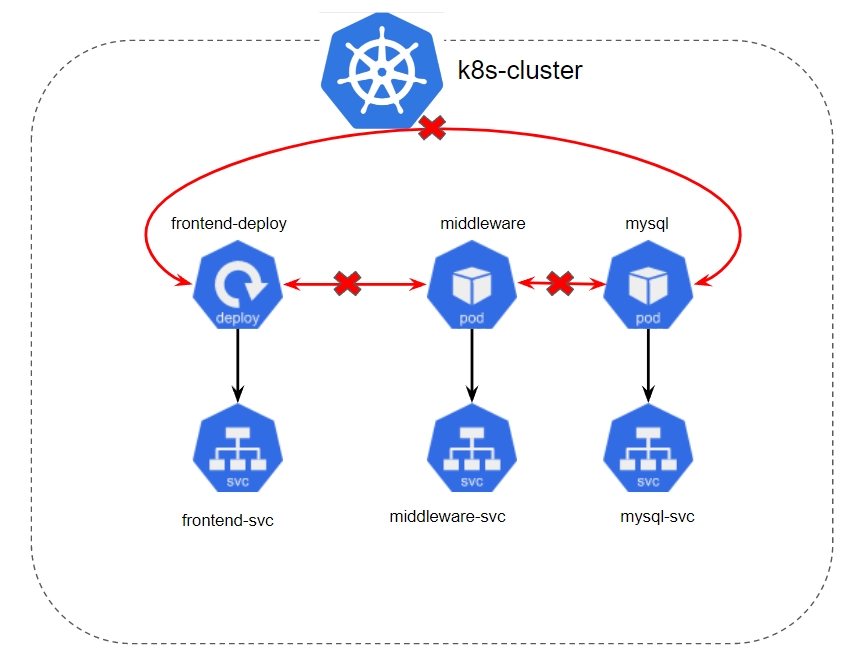
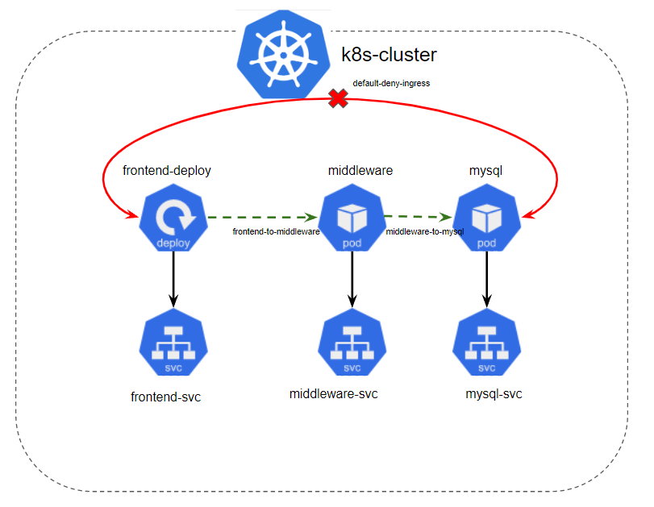

The default deny policy we created in our previous lab serves as a fundamental security baseline, rejecting any network interactions that aren't explicitly allowed. In effect, it's a stringent (строгий) **blacklist** of all communications within the cluster. With this in place, we can now layer more specific network policies on top to define and allow the required interactions.

<br>

### Allowing Traffic between Specific Pods

For our three-tier application, the frontend needs to connect to the middleware, and the middleware needs to connect to the MySQL database. However, the frontend shouldn't have direct access to the MySQL database. We can shape these connections using specific network policies.

The YAML file for the network policy that allows traffic from the frontend to the middleware could look like this:

```yaml
apiVersion: networking.k8s.io/v1
kind: NetworkPolicy
metadata:
  name: frontend-to-middleware
  namespace: default
spec:
  podSelector:
    matchLabels:
      app: middleware
  ingress:
  - from:
    - podSelector:
        matchLabels:
          app: frontend
```

This policy selects the middleware pod with the label `app: middleware` and allows traffic from pods with the label `app: frontend`. It effectively establishes a connection from the frontend to the middleware.

Similarly, we can define a network policy to allow traffic from the middleware to the MySQL database.

<br>

With these specific network policies in place, our three-tier application will function correctly, as traffic is allowed where necessary. However, our Kubernetes cluster remains secure, as the default deny policy continues to block any other communications not explicitly permitted.

Remember, Kubernetes Network Policies apply at the namespace level. The policies we've created apply to the `default` namespace, but in a multi-namespace cluster, similar policies would need to be created for each namespace.