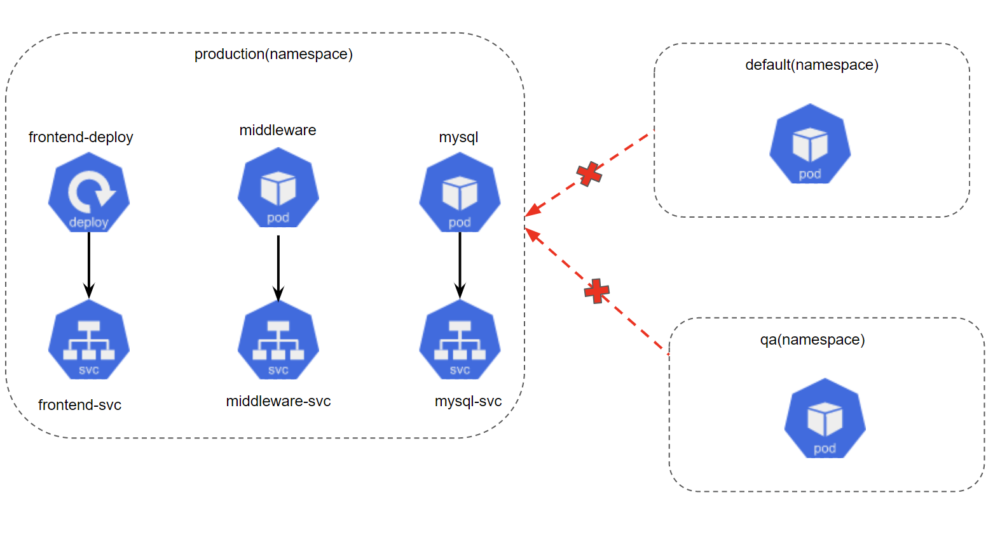
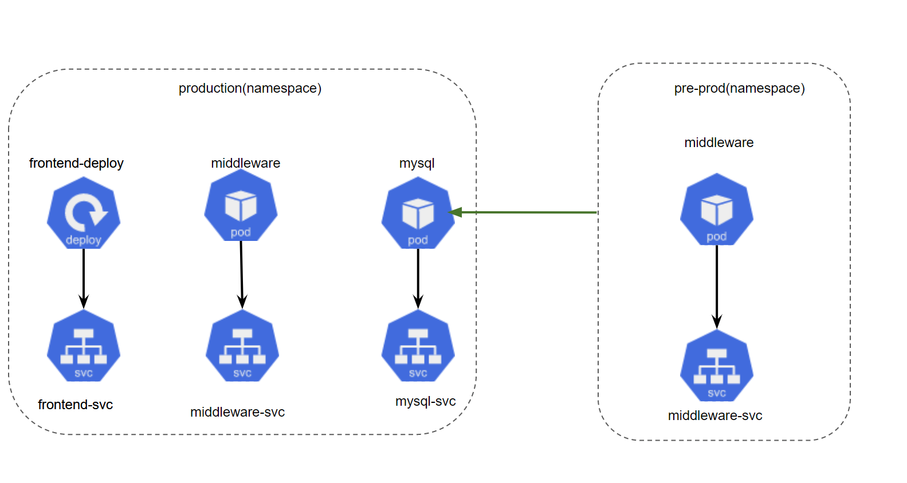
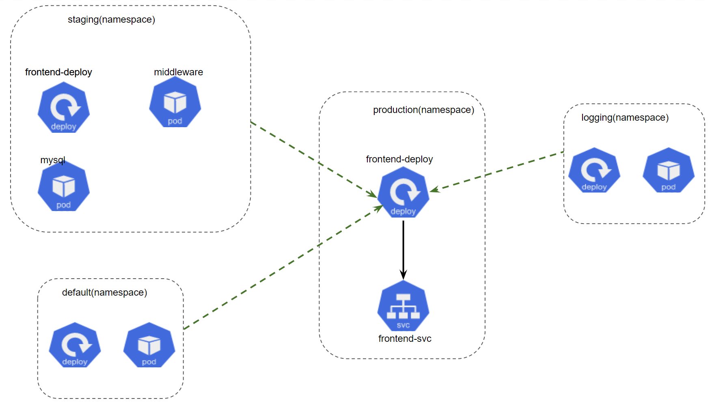
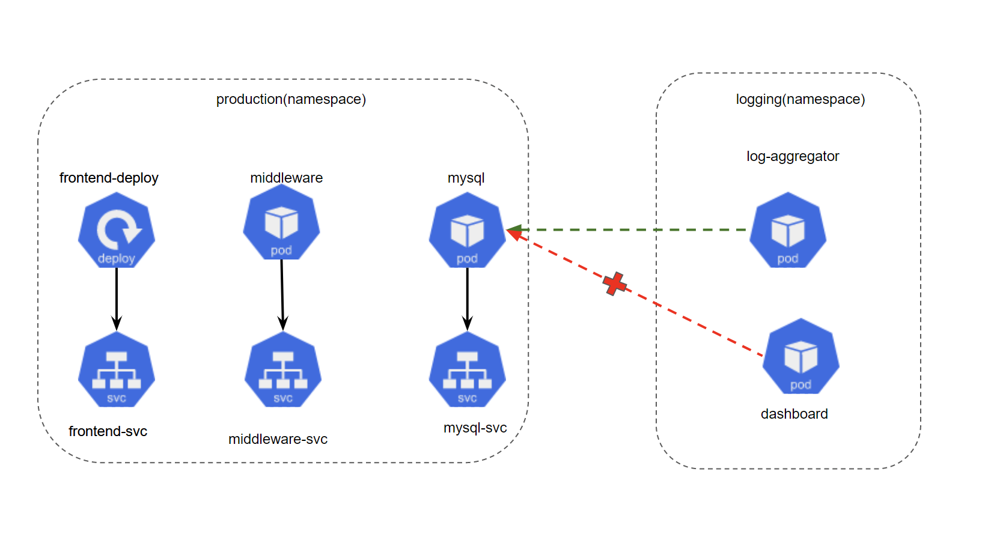

In Kubernetes, namespaces are a fundamental concept that enables logical partitioning of resources within a cluster. By dividing cluster resources among multiple namespaces, teams can segregate their environments, control access, and manage resources more effectively. As part of this multi-tenant approach, Kubernetes Network Policies play a crucial role. They allow administrators to define rules for traffic flowing between pods, even when these pods are spread across multiple namespaces.

### nameSpace Selector

So far in our labs, we've used `podSelector` for managing traffic between pods within a namespace. For cross-namespace scenarios, we employ (используем) `namespaceSelector`, which, based on namespace labels, manages traffic between different namespaces. It offers a higher-level control for implementing network isolation at the namespace level.

Here's a simple YAML snippet using `namespaceSelector`:

```yaml
ingress:
- from:
  - namespaceSelector:
      matchLabels:
        project: myproject
```

In this example, the policy allows traffic from any pod in any namespace labeled with `project: myproject`.

### Scenario 1: Denying All Traffic from Other Namespaces

Consider a production environment, where all three tiers of our application - frontend, middleware, and mysql - are deployed within a `production` namespace. For security reasons, it's crucial that pods within this namespace are not accessible from any other namespace. We can achieve this with the same `default deny` policy in the `production` namespace. We have already explored this policy in the previous labs.

<br>

In this example, the Network Policy would deny access to the pods in the `production` namespace from other namespaces such as `qa` and `default`.

### Scenario 2: Allowing Traffic from a Specific Namespace

In another scenario, you might need to permit access from a specific namespace. For example, let's say you have a `middleware` pod in the `pre-prod` namespace that requires read access to the MySQL database in the `production` namespace.

<br>

To do this, we would use a `namespaceSelector` (instead of the `podSelector` that we have used several times already) in the ingress rule that would allow traffic from all the pods of a specific namespace.

In this example, we are selecting the entire `pre-prod` namespace in the ingress rule.

This would mean that that the `middleware` pod, along with any other existing or future pods that are deployed in the `pre-prod` namespace would be able to connect to the `mysql` pod in the `production` namespace.

### Scenario 3: Allowing Traffic to Specific Pods from All Namespaces

In some cases, you might want to allow traffic from all namespaces to certain pods within a namespace. For instance, the `frontend` pods in our `production` namespace might need to be accessible from pods across all namespaces.

<br>

In this case, we have 4 different namespaces in our cluster. The pods belonging to the `frontend-deploy` deployment need to be accessible from all pods in the `staging`, `default`, `logging` as well as the `production` namespace.

To do this, we will again use the `namespaceSelector` but this time, we will use a blanket (общее) rule to select all namespaces in the cluster.

### Scenario 4: Allowing Traffic from Specific Pods in Another Namespace

Let's say you have a `logging` namespace with a `log-aggregator` pod that needs to access the `middleware` and MySQL pods in the `production` namespace to collect logs. Only the `log-aggregator` pod should be able to connect to MySQL, all other pods in the `logging` namespace be restricted.

<br>

To do this, we can combine `namespaceSelector` and the `podSelector` in the ingress rules to target specific pods in specific namespaces.