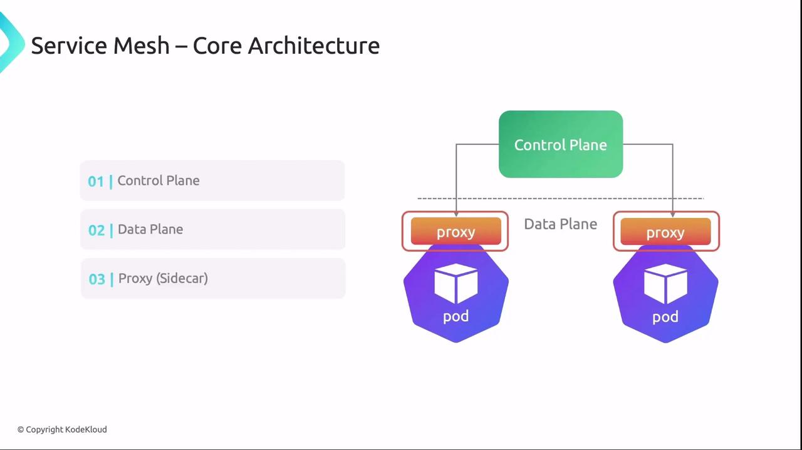
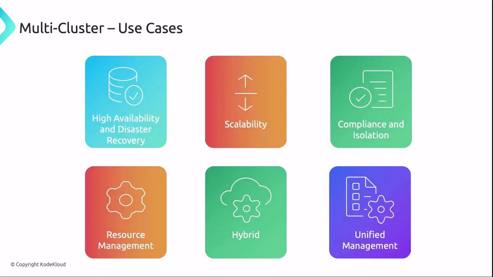
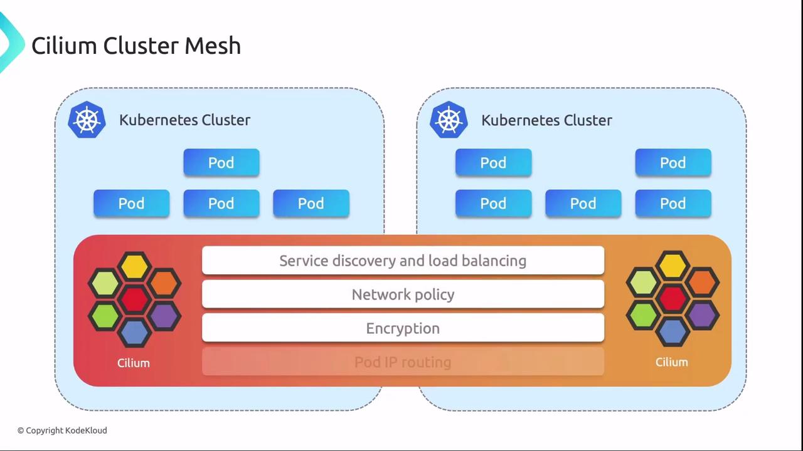

This article discusses Kubernetes networking patterns, specifically Service Mesh and Multi-Cluster, and their benefits for cloud-native applications.

Two powerful Kubernetes networking patterns - Service Mesh and Multi-Cluster - can dramatically improve scalability, security, and availability for cloud-native applications. Although Company X doesn't implement these in production today, mastering them offers deep insights into modern Kubernetes networking.

### Service Mesh

A Service Mesh is a dedicated infrastructure layer for handling service-to-service communication in microservices environments. Offloading networking logic to the mesh lets developers focus on application code, while the mesh provides:

- Traffic Management
- Security
- Observability

Service Mesh isn't part of Company X's current stack, but understanding it is crucial for complex microservices landscapes.

#### Key Benefits

| Benefit | Description |
| ------- | ----------- |
| Traffic Management | Canary releases, A/B testing, blue/green deployments |
| Security | mTLS encryption, automatic certificate rotation, policy enforcement |
| Observability | Metrics, logs, distributed tracing for deep insights |

#### Popular Providers

| Provider | Description | Website |
| -------- | ----------- | ------- |
| Istio | Rich feature set, Envoy integration for complex environments | [istio.io](https://istio.io/) |
| Linkerd  | Lightweight, high-performance, minimal operational overhead | [linkerd.io](https://linkerd.io/) |
| Cilium   | eBPF-powered mesh combining networking and security | [cilium.io](https://cilium.io/) |

#### Core Architecture

Service Mesh consists of three main components:

1. **Control Plane**\
   Manages service discovery, configuration distribution, policy enforcement, and telemetry aggregation.
2. **Data Plane**\
   Sidecar proxies (e.g., Envoy) intercept and control all network traffic for each service instance.
3. **Sidecar Proxy**\
   Enforces routing rules, load balancing, security policies, and collects telemetry in each pod.

**Proper certificate lifecycle management is critical for mTLS. Misconfigured certificates can lead to downtime or security gaps.**

 

#### Use Cases

1. **Canary Deployments for A/B Testing**\
   Gradually shift (постепенное переключение) a small percentage of traffic to a new version before full rollout.

2. **Enhanced Security & Compliance**\
   Automatically enforce mTLS, RBAC, and network policies for sensitive data flows.

3. **High Availability**\
   Detect unhealthy instances and reroute traffic to healthy pods, ensuring continuous service.

### Multi-Cluster

Operating multiple Kubernetes clusters - either independently or as a cohesive system (либо независимо, либо как целостная система) - enables:

| Use Case               | Benefit                                                         |
| ---------------------- | --------------------------------------------------------------- |
| High Availability & DR | Regional distribution with automatic failover                   |
| Scalability            | Horizontally scale workloads across clusters                    |
| Compliance & Isolation | Dedicated clusters for regulated or sensitive workloads         |
| Resource Management    | Tailor clusters for specific performance or cost requirements   |
| Hybrid Deployments     | Combine on-premises and multiple clouds to avoid vendor lock-in |
| Unified Management     | Centralized control via Federation or Anthos                    |

 

Key tools for Multi-Cluster control:

- Kubernetes Federation ([docs](https://kubernetes.io/docs/concepts/cluster-administration/federation/))
- Google Anthos ([cloud.google.com/anthos](https://cloud.google.com/anthos))

### Combining Service Mesh and Multi-Cluster

Merging Service Mesh with Multi-Cluster delivers:

- **Unified Service Communication**\
  Cross-cluster service discovery and secure connectivity.
- **Centralized Policy & Security**\
  Single policy definition enforced across all clusters with mTLS.
- **Global High Availability**\
  Dynamic traffic routing ensures uptime even if an entire cluster fails.
- **Consolidated Observability**\
  Centralized logging, metrics, and tracing from every cluster.

### Cilium Cluster Mesh

Since Company X uses Cilium as its CNI, Cilium Cluster Mesh extends networking and security across clusters with eBPF:

- Seamless service discovery and connectivity
- Consistent network policies and encryption
- Cross-cluster load balancing and failover
- Unified observability

**Cilium Cluster Mesh requires host kernel support for eBPF features.**

 

Getting started only requires multiple clusters running Cilium and network connectivity between them.

### Conclusion

Service Mesh and Multi-Cluster architectures provide:

- Advanced traffic management, mTLS security, and observability
- Geographic high availability, scalability, and operational flexibility
- A unified, resilient platform when used together, especially with Cilium Cluster Mesh