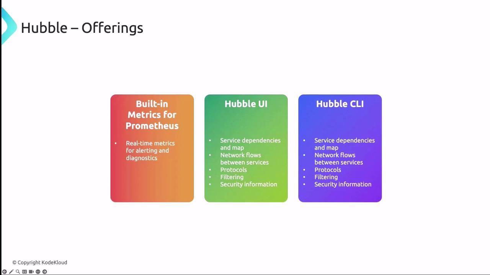

Cilium Hubble enhances network observability, troubleshooting, and security for Kubernetes clusters through eBPF, offering metrics, UI/CLI tools, and integrations with Prometheus and Grafana.

Cilium Hubble extends (расширяет) Cilium's eBPF datapath to deliver (обеспечивая) unparalleled (непревзойденную) network observability, troubleshooting, and security enforcement for Kubernetes clusters. In this guide, we'll cover Hubble's architecture, built-in metrics, UI/CLI tools, and how to integrate with Prometheus and Grafana.

Hubble components:

- **eBPF datapath** on each node for flow and event capture
- **Relay** to aggregate data across nodes
- **Integrations** with Prometheus (metrics), Grafana (dashboards, service maps), and Hubble UI/CLI for interactive inspection (проверка)

<br>

### Built-in Metrics for Prometheus

Hubble exports metrics in the [Prometheus OpenMetrics format](https://prometheus.io/docs/instrumenting/exposition_formats/), making it simple to monitor network health and trigger alerts on key events:

| Metric Category   | Tracks                                          | Use Case                                     |
| ----------------- | ----------------------------------------------- | ---------------------------------------------|
| dns               | DNS queries, failures, latencies                | Alert on high DNS failure rate               |
| drop              | Packet drops by policy or error                 | Identify unintended policy blocks            |
| tcp               | TCP connections, retransmissions, resets        | Detect connection instability                |
| flow              | Flow counts, throughput, duration               | Baseline (базовые показатели) traffic trends |
| port-distribution | Top port usage across services                  | Spot (обнаружение) unexpected open ports     |
| icmp              | ICMP echo requests and replies                  | Monitor ping flood or unreachable hosts      |
| httpV2            | HTTP/2 metrics with exemplars and label context | Trace request latencies with context labels  |

- HTTP/2 metrics with exemplars (примерами) and label context (контекстными метками)
- Trace request latencies with context labels (с использованием контекстных меток)

**Enable only the metrics you need to reduce data volume and improve query performance.**

#### Enabling Hubble Metrics via Helm

When installing or upgrading Cilium with Helm, you can enable Hubble and Prometheus integration in one step:

```bash
$ helm upgrade cilium cilium/cilium --version CILIUM_VERSION \
    --namespace kube-system \
    --reuse-values \
    --set hubble.enabled=true \
    --set hubble.relay.enabled=true \
    --set hubble.ui.enabled=true \
    --set hubble.metrics.enableOpenMetrics=true \
    --set prometheus.enabled=true \
    --set operator.prometheus.enabled=true \
    --set hubble.metrics.enabled="{dns,drop,tcp,flow,port-distribution,icmp,httpV2:exemplar=true;labelsContext=source_ip\,source_namespace\,source_workload\,destination_ip\,destination_namespace\,destination_workload\,traffic_direction}"
```

### Hubble UI and CLI

Hubble offers both a web-based UI and a scriptable CLI, providing deep visibility into service interactions, network flows, and security policy verdicts.

<br>

#### Hubble UI

The Hubble UI delivers interactive dashboards and service maps:

* **Service Dependency Map**\
  Visualize inter-service communication to spot bottlenecks or misconfigurations.
* **Flow Table**\
  Inspect individual network flows with source/destination, protocol details, performance metrics, and policy verdicts.
* **Security Events**\
  Review blocked connections, policy violations (нарушения), and external access attempts.

Example service dependency graph:

<br>

**Avoid exposing the Hubble UI publicly without proper authentication. Use port-forwarding or an ingress with strong access controls.**

#### Launching Hubble UI Locally

Forward the UI port to your workstation:

```bash
$ cilium hubble ui
# Forwarding from 0.0.0.0:12000 -> 8081
# Forwarding from [::]:12000 -> 8081
```

Then browse to [http://localhost:12000](http://localhost:12000).

#### Hubble CLI

The Hubble CLI offers the same visibility in a terminal-friendly format, ideal for automation and scripts.

Check the status inside a Cilium agent pod:

```bash
$ kubectl exec -n kube-system -it cilium-xxxxxx -c cilium-agent -- hubble status
# Healthcheck (via unix:///var/run/cilium/hubble.sock): Ok
# Current/Max Flows: 4,095/4,095 (100.00%)
# Flows/s: 4.72
```

#### Installing the Hubble CLI on Linux

```bash
HUBBLE_VERSION=$(curl -s https://raw.githubusercontent.com/cilium/hubble/master/stable.txt)
HUBBLE_ARCH=amd64
if [ "$(uname -m)" = "aarch64" ]; then
  HUBBLE_ARCH=arm64
fi

$ curl -L --fail --remote-name-all \
    https://github.com/cilium/hubble/releases/download/$HUBBLE_VERSION/hubble-linux-${HUBBLE_ARCH}.tar.gz \
    https://github.com/cilium/hubble/releases/download/$HUBBLE_VERSION/hubble-linux-${HUBBLE_ARCH}.tar.gz.sha256sum

$ sudo tar xvzf hubble-linux-${HUBBLE_ARCH}.tar.gz -C /usr/local/bin
$ rm hubble-linux-${HUBBLE_ARCH}.tar.gz.sha256sum
```