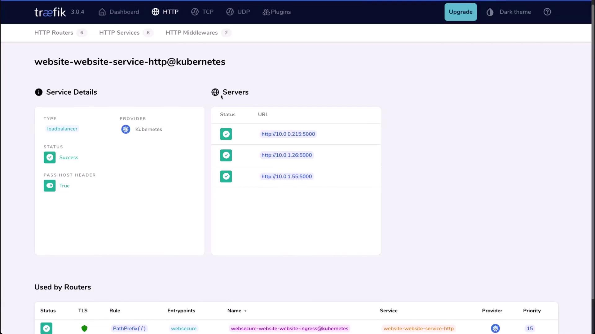

In this lesson, we'll explore the Traefik dashboard - a powerful observability interface enabled by default in every Traefik installation. The dashboard provides real-time insights into routing rules, service health, and security settings. For production environments, avoid exposing this dashboard publicly. Use a private network or [kubectl port-forward](https://kubernetes.io/docs/tasks/access-application-cluster/port-forward-access-application/) instead. In this lab, we will configure a NodePort (30000) for direct access.

### 1. Deploy the Traefik Dashboard Service

Create a Service of type `NodePort` to expose the Traefik API port:

```yaml
# service-dashboard.yaml
apiVersion: v1
kind: Service
metadata:
  name: traefik-dashboard-service
  namespace: default
spec:
  type: NodePort
  ports:
  - name: dashboard
    port: 9000
    targetPort: traefik
    nodePort: 30000
  selector:
    app.kubernetes.io/instance: traefik-default
```

Apply and verify the Service:

```bash
$ kubectl apply -f service-dashboard.yaml
$ kubectl describe svc -n traefik traefik-dashboard-service
```

Expected output:

```text
Name:                     traefik-dashboard-service
Namespace:                default
Selector:                 app.kubernetes.io/instance=traefik-default
Type:                     NodePort
IP:                       10.108.77.204
Port:                     dashboard  9000/TCP
TargetPort:               traefik/TCP
NodePort:                 dashboard 30000/TCP
Endpoints:                10.0.1.192:9000
```

### 2. Enable Insecure API Access

By default, Traefik's API/dashboard is secured. For this lab, we'll enable insecure access by adding `--api.insecure=true` to the deployment arguments.

Edit the Traefik deployment:

```bash
$ kubectl -n default edit deployment traefik
```

Under the container spec's `args:` section, include:

```yaml
args:
  - "--api.dashboard=true"
  - "--api.insecure=true"
  - "--entryPoints.metrics.address=:9100/tcp"
  - "--entryPoints.traefik.address=:9000/tcp"
  - "--entryPoints.web.address=:8000/tcp"
  - "--entryPoints.websecure.address=:8443/tcp"
  - "--metrics.prometheus=true"
  - "--metrics.prometheus.entrypoint=metrics"
  - "--providers.kubernetescrd"
  - "--providers.kubernetesingress"
  - "--entryPoints.websecure.http.tls=true"
  - "--log.level=INFO"
  - "--accesslog=true"
  - "--accesslog.fields.defaultmode=keep"
  - "--accesslog.fields.headers.defaultmode=drop"
  - "--ping=true"
  - "--global.sendanonymoususage"
```

Save and exit. The deployment will rollout updated pods:

```bash
$ kubectl -n default get pods
```

You should see:

```text
NAME                         READY   STATUS    RESTARTS   AGE
traefik-79554cb74d-txqdf     1/1     Running   0          30s
```

### 3. Access the Dashboard

Open port 30000 on your node and navigate to:

```text
http://<node-ip>:30000
```

On the dashboard, you'll find:

- **Entry Points**: Listening ports on the Traefik pod
- **Routers**: Rules mapping incoming requests to services
- **Services**: Backend services and their endpoints
- **Middlewares**: Request transformations (none configured here)

#### Entry Points Overview

| Entry Point | Port | Protocol | TLS Enabled |
| ----------- | ---- | -------- | ----------- |
| metrics     | 9100 | TCP      | No          |
| traefik     | 9000 | TCP      | No          |
| web         | 8000 | TCP      | No          |
| websecure   | 8443 | TCP      | Yes         |

#### Inspecting Services

On the **Services** page, you can drill into each service's pods and endpoints. In our CompanyX application, all services show healthy endpoints:

<br>

### 4. Scale the Application

Let's scale the CompanyX website to 5 replicas:

```bash
$ kubectl scale deployment companyx-website --replicas=5
```

Verify new pods:

```bash
$ kubectl -n companyx get pods
```

```text
NAME                                  READY   STATUS    RESTARTS   AGE
companyx-website-5d596d7d7d-abc12     1/1     Running   0          1m
companyx-website-5d596d7d7d-def34     1/1     Running   0          1m
companyx-website-5d596d7d7d-ghi56     1/1     Running   0          1m
companyx-website-5d596d7d7d-jkl78     1/1     Running   0          1m
companyx-website-5d596d7d7d-mno90     1/1     Running   0          1m
```

Refresh the Traefik dashboard - you'll now see five healthy pods listed under the CompanyX service.

**In a production setup, secure the dashboard with authentication or restrict access to a private network.**