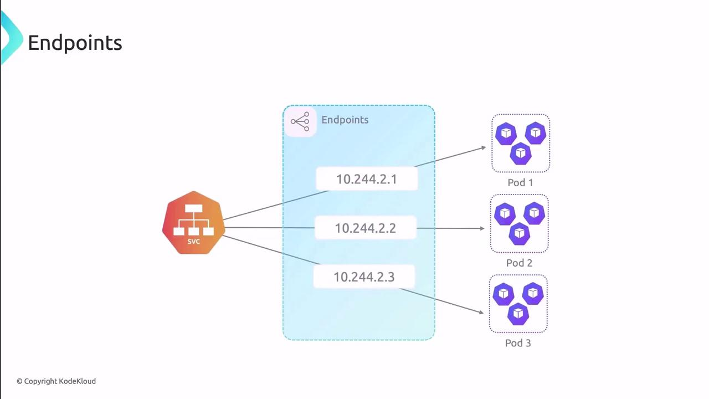
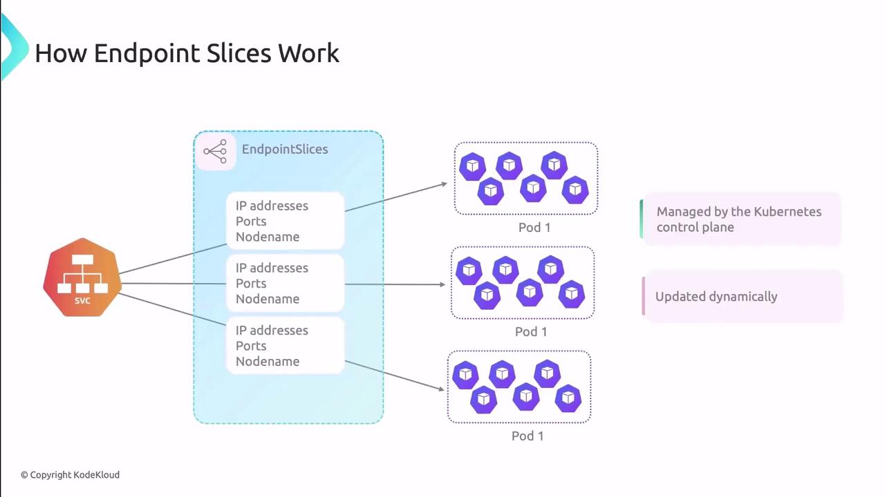

Kubernetes Services provide a stable network endpoint for Pods, but under the hood, Services rely on two resources - **Endpoints** and **Endpoint Slices** - to map Service selectors to Pod IPs and ports. This guide explains how each resource works, their roles in traffic routing, and how to inspect them.

## Endpoints

An Endpoint object in Kubernetes keeps track of all Pod IPs and ports that back (используются) a Service. When you create a Service, Kubernetes uses its label selector to identify matching Pods and generates an Endpoints object with the same name.

<br>

As Pods are created, deleted, or updated, the Endpoints object is managed automatically by the control plane - no manual edits are needed.

### Inspecting an Endpoints Object

Use `kubectl` to view the Endpoints backing a Service:

```bash
$ kubectl get endpoints SERVICE_NAME -o yaml
```

Example output:

```yaml
subsets:
- addresses:
  - ip: 10.244.1.172
    nodeName: node
    targetRef:
      kind: Pod
      name: pod-name-5f68f556c8-25nb9
      namespace: default
  ports:
  - name: HTTP
    port: 80
    protocol: TCP
```

Fields explained:

- `subsets`: Groups of addresses and ports.
- `addresses`: Lists Pod IPs and node names.
- `ports`: Indicates which port names and protocols are exposed.

### Limitations of Endpoints

**Warning**

Each Endpoints object can hold up to 1,000 addresses. In large clusters or high-scale environments, this cap (ограничение) may lead to performance bottlenecks or truncated endpoint lists.

| Resource | Maximum Addresses | Impact |
| ----------- | ----------- | ----------- |
| Endpoints | 1,000	| May require Service sharding or slicing |

## Endpoint Slices

Introduced as a beta feature in v1.17 and GA in v1.21, Endpoint Slices solve the scalability issues of Endpoints by splitting Pod endpoints into multiple, smaller objects. Each slice holds a subset of IPs, ports, and metadata, reducing control-plane load.

Endpoint Slices support optional fields like **topology hints**, enabling you to optimize traffic routing based on node labels or zones.

### How Endpoint Slices Work

<br>

- **Slices per Service**: Multiple Endpoint Slice objects can coexist for one Service.
- **Subset Size**: By default, each slice holds up to 100 endpoints, configurable via the EndpointSlice API.
- **Automatic Updates**: The control plane synchronizes slices as Pods change state.

### Viewing Endpoint Slices

```bash
$ kubectl get endpointslices SERVICE_NAME-UID -o yaml
```

Sample YAML:

```yaml
endpoints:
- addresses:
  - 10.244.1.172
  conditions:
    ready: true
    serving: true
    terminating: false
  nodeName: worker
  targetRef:
    kind: Pod
    name: pod-name-5f68f556c8-25nb9
    namespace: default
    uid: e77f4587-6d20-48bb-b5f6-f6df51a886d
  ports:
  - name: http
    port: 80
    protocol: TCP
```

| Feature | Endpoints | Endpoint Slices |
| ----------- | ----------- | ----------- |
| Scalability | <=1,000 IPs | Configurable slice size, multiple slices per Service |
| Metadata & Topology | Limited | Supports zone hints, custom labels |
| Control-Plane Load | Higher | Distributed across slices, fewer large updates overall |