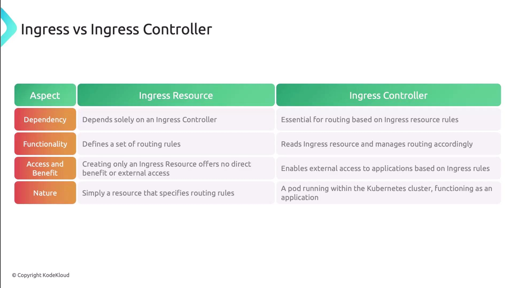
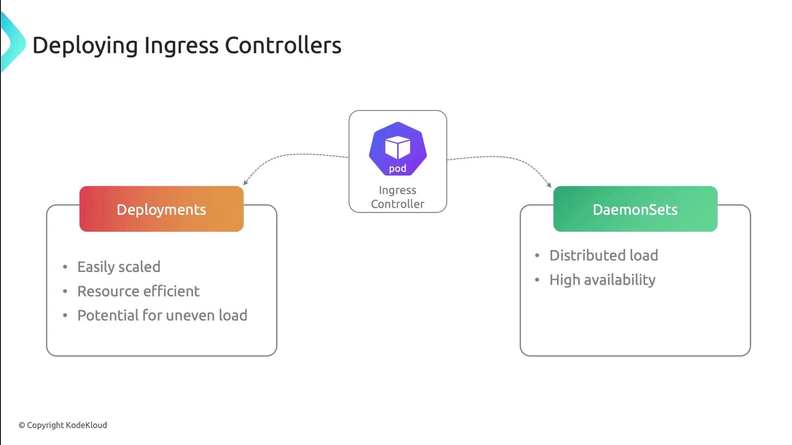
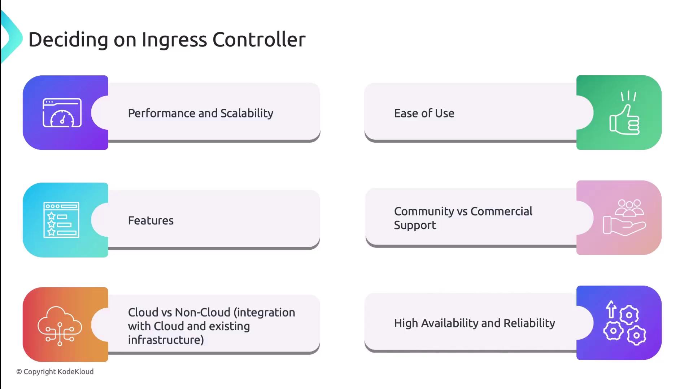

In this lesson, we dive deep into Kubernetes Ingress controllers and learn how they route external traffic into your cluster. Remember: an **Ingress Resource** defines the routing rules, but without an **Ingress Controller**, those rules are never enforced.

### Ingress Resource vs Ingress Controller

An **Ingress Resource** is a Kubernetes object that declares hostname- and path-based routing rules. By itself, it performs no traffic routing.

An **Ingress Controller** is a Pod (or set of Pods) running inside the cluster. It monitors Ingress resources and programs the underlying proxy or load balancer to enforce those rules.

| Aspect        | Ingress Resource                    | Ingress Controller                         |
| ------------- | ----------------------------------- | ------------------------------------------ |
| Definition    | Kubernetes object for routing rules | Component (Pod) that reads Ingress objects |
| Functionality | Declares host/path rules            | Implements rules, load-balances traffic    |
| Runtime       | No running process                  | Runs inside cluster                        |
| Benefit       | No effect without a controller      | Routes external traffic to Services        |

 

**Defining an Ingress without an active controller means no external traffic will reach your Services.**

### Kubernetes Architecture with Ingress

Clients send HTTP(S) requests to the cluster's external endpoint. The Ingress controller intercepts these requests, matches them against Ingress rules, and forwards them to the appropriate Service, which then load-balances to the backend Pods.

### Cloud-based Ingress Controllers

Cloud providers offer managed Ingress controllers that integrate with native infrastructure services - load balancers, firewalls, IAM, and more - simplifying setup and scaling.

| Controller                   | Cloud Provider | Key Features                             |
| ---------------------------- | -------------- | ---------------------------------------- |
| AWS Load Balancer Controller | AWS            | ALB & NLB provisioning, Auto scaling     |
| Google Cloud Load Balancer   | GCP            | GKE integration, Global load balancing   |
| Azure Application Gateway    | Azure          | SSL termination, WAF, path-based routing |

Key benefits:

- Automatic provisioning of cloud LoadBalancer resources
- Built-in security features (WAF, IAM integration)
- Managed upgrades and high availability
- Reduced operational overhead

 

### Non-cloud-based Ingress Controllers

Self-managed controllers run anywhere you choose - on-premises, private clouds, or public clouds where you handle cluster exposure. You'll need to configure a Service of type LoadBalancer or NodePort to expose the Ingress controller externally.

| Controller               | Use Case            | Highlights                              |
| ------------------------ | ------------------- | --------------------------------------- |
| NGINX Ingress Controller | General purpose     | Reverse proxy, SSL/TLS, rate-limiting   |
| Traefik                  | Dynamic auto-config | HTTP/HTTPS routing, metrics, dashboard  |
| HAProxy Ingress          | Performance-focused | Low-latency load balancing, TCP support |

### Deployment Models: Deployment vs DaemonSet

Choosing **Deployment** or **DaemonSet** affects how Ingress Pods are scheduled, how traffic is distributed, and resource consumption.

 

Uneven - неравномерный.

| Option | Pros | Cons |
| ---------- | ---------- | ---------- |
| Deployment | Dynamic scaling, resource-efficient | Uneven load distribution on nodes |
| DaemonSet | One Pod per node, uniform traffic distribution, high availability | Higher resource usage per node count |

- Use **Deployment** when traffic patterns fluctuate and you want to optimize resource usage.
- Use **DaemonSet** for uniform low-latency ingress (равномерного входящего трафика) on every node and built-in failover.

### Factors to Consider

Before selecting an Ingress controller or deployment model, evaluate:

- Traffic volume, throughput, and latency requirements
- Scaling capabilities (static vs dynamic)
- Features: supported protocols, SSL/TLS, middleware (auth, rate limiting)
- Integration with your cloud or on-prem infrastructure
- Configuration complexity and learning curve
- API/automation support for CI/CD integration
- Community support, plugin ecosystem, and commercial options
- Cost: managed service fees (платежи) vs self-managed resource costs
- High availability, failover strategies, and load balancing algorithms

 