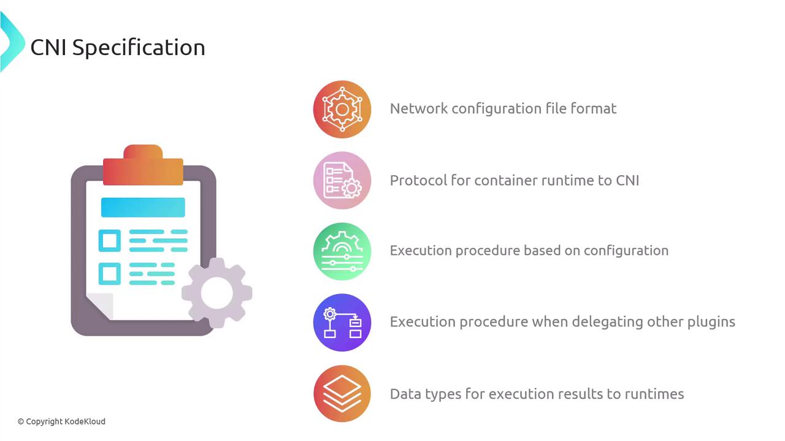
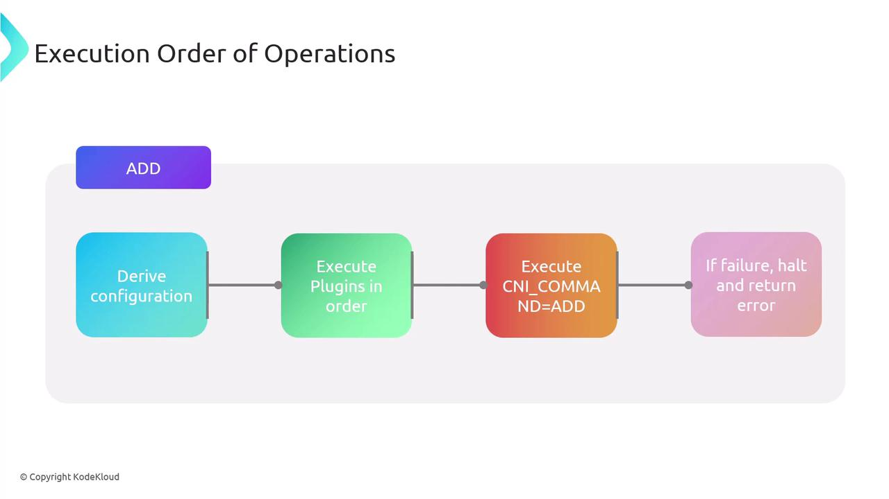
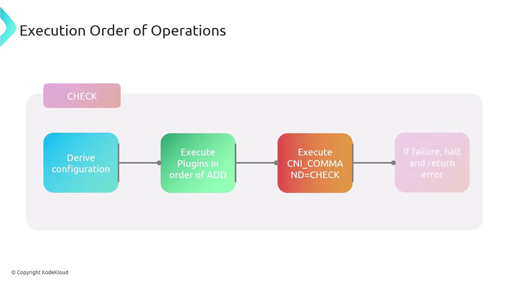
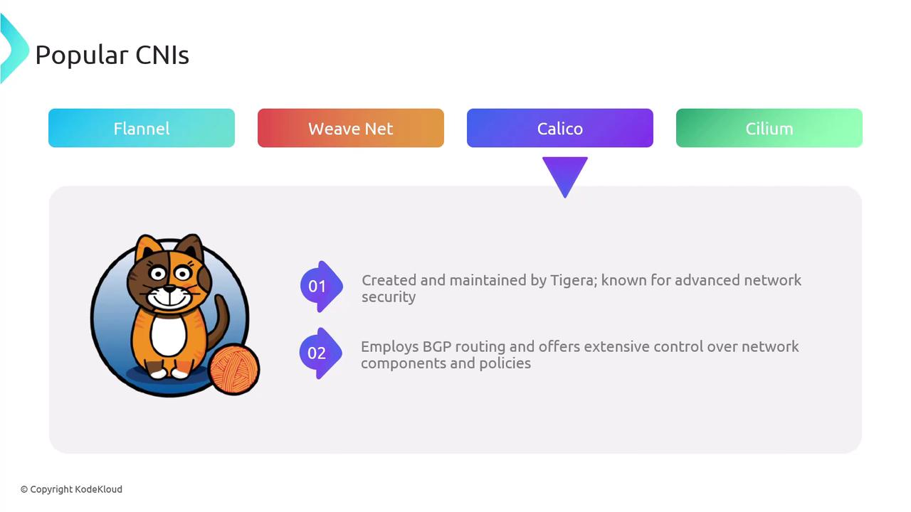
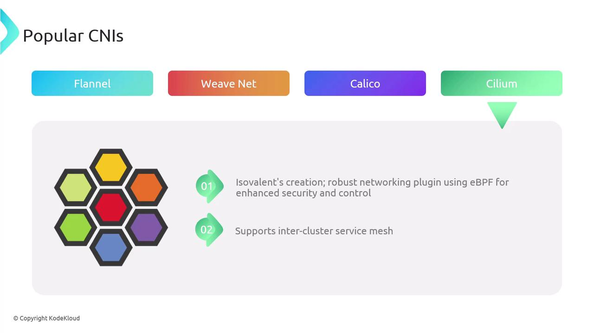

## What Is CNI?

The Container Network Interface is a **CNCF** project defining a standard for configuring network interfaces in Linux and Windows containers. It provides:

- A **specification** for network configuration files (JSON).
- **Libraries** for writing networking plugins.
- A **protocol** that container runtimes (e.g., containerd, CRI-O) use to invoke plugins.

When a container is created or deleted, CNI allocates (выделяет) or cleans up network resources, delivering (предоставляя) a unified (единый) interface for orchestrators like Kubernetes.

## How CNI Works

Under the hood, the container runtime handles network setup by invoking one or more CNI plugin binaries. Here's the typical workflow in Kubernetes:

- **API Server => Kubelet**: Request to create a Pod.
- **Kubelet => Runtime**: Allocate a new network namespace for the pod.
- **Runtime => CNI Plugin**: Invoke plugin(s) with JSON config via stdin.
- **Plugin(s) => Runtime**: Return interface details on stdout.
- **Runtime => Container**: Launch container in the prepared namespace.

<br>

CNI plugin binaries must be installed on every node (default: `/opt/cni/bin`). Without them, pods may fail to start.

## CNI Specification Overview

The CNI spec comprises (включает в себя):

- A JSON schema for network configuration.
- A naming convention for network definitions and plugin lists.
- An execution protocol using environment variables.
- A mechanism for chaining multiple plugins.
- Standard data types for operation results.

<br>

### Network Configuration Files

Configuration lives in a JSON file interpreted by the runtime at execution time. You can chain multiple plugins:

```json
{
  "cniVersion": "1.1.0",
  "name": "dbnet",
  "plugins": [
    {
      "type": "bridge",
      "bridge": "cni0",
      "keyA": ["some", "plugin", "configuration"],
      "ipam": {
        "type": "host-local",
        "subnet": "10.1.0.0/16",
        "gateway": "10.1.0.1",
        "routes": [{"dst": "0.0.0.0/0"}]
      }
    },
    {
      "dns": {"nameservers": ["10.1.0.1"]}
    },
    {
      "type": "tuning",
      "capabilities": {"mac": true},
      "sysctl": {"net.core.somaxconn": "500"}
    },
    {
      "type": "portmap",
      "capabilities": {"portMappings": true}
    }
  ]
}
```

Each object in `plugins` is invoked in sequence for setup or teardown (вызывается последовательно для установки или завершения работы).

### Plugin Execution Protocol

CNI relies on environment variables to pass context:

| Variable | Description |
| ----------- | ----------- |
| `CNI_COMMAND` | Operation (`ADD`, `DEL`, `CHECK`, `VERSION`) |
| `CNI_CONTAINERID` | Unique container identifier |
| `CNI_NETNS` | Path to container's network namespace |
| `CNI_IFNAME` | Interface name inside the container |
| `CNI_ARGS` | Additional plugin-specific arguments |
| `CNI_PATH` | Paths to locate CNI plugin binaries |

**Core Operations**

- `ADD`: Attach and configure an interface.
- `DEL`: Detach and cleanup.
- `CHECK`: Validate current network state.
- `VERSION`: Query supported CNI versions.

A network attachment is uniquely identified by (однозначно идентифицируется по формуле) `CNI_CONTAINERID` + `CNI_IFNAME`. Plugins read JSON config from stdin and write results to stdout.

### Execution Flow

When running `ADD`:

- Derive (определить) the network configuration.
- Execute plugin binaries **in listed order** (в указанном порядке) with `CNI_COMMAND=ADD`.
- Halt (остановиться) on any failure and return an error.
- Persist (сохранить) success data for later `CHECK` or `DEL`.

<br>

The `DEL` operation runs plugins in **reverse order**. `CHECK` follows the same sequence as `ADD` but performs validations only.

<br>

### Chaining and Delegation

CNI supports chaining multiple plugins. A parent plugin can delegate tasks to child plugins. On failure, the parent invokes a `DEL` on all delegates (делегатов) before returning an error, ensuring cleanup.

### Result Types

CNI operations return standardized JSON for:

- **Success**: Contains `cniVersion`, configured interfaces, IPs, routes, DNS.
- **Error**: Includes `code`, `msg`, `details`, `cniVersion`.
- **Version**: Lists supported spec versions.

Example **error** response:

```json
{
  "cniVersion": "1.1.0",
  "code": 7,
  "msg": "Invalid Configuration",
  "details": "Network 192.168.0.0/31 too small to allocate from."
}
```

## Key Features of CNI

1. **Standardized Interface**: Unified API for all container runtimes.
2. **Flexibility**: Supports a vast (обширную) ecosystem of plugins.
3. **Dynamic Configuration**: Runtime-driven setup and teardown (завершение работы).
4. **Ease of Integration**: Embeds directly into container runtimes.
5. **Compatibility**: Versioned specs for interoperability (совместимость).

## Popular CNI Plugins

<br>

- **Flannel** - A CoreOS project providing simple IPv4 layer-3 networking.
- **Weave Net** - Weaveworks' layer-2 overlay with built-in encryption and network policies.

<br>

- **Calico** - Tigera's solution featuring (включающее) scalable BGP routing and robust (крепкий, надежный) network policies.

<br>

- **Cilium** - Leverages eBPF for deep network and security visibility, plus inter-cluster service mesh capabilities.

Many cloud providers (AWS, Azure, GCP) also offer CNI implementations optimized for their platforms.

#### Comparison of Popular CNIs

| Plugin | Type | Key Features |
| ----------- | ----------- | ----------- |
| Flannel | L3 Overlay | Simple IPv4 overlay, minimal policy |
| Weave Net | L2 Overlay | Encryption, built-in network policies |
| Calico | BGP Routing | Scalable, advanced security policies |
| Cilium | eBPF-Powered | Fine-grained policies, service mesh |