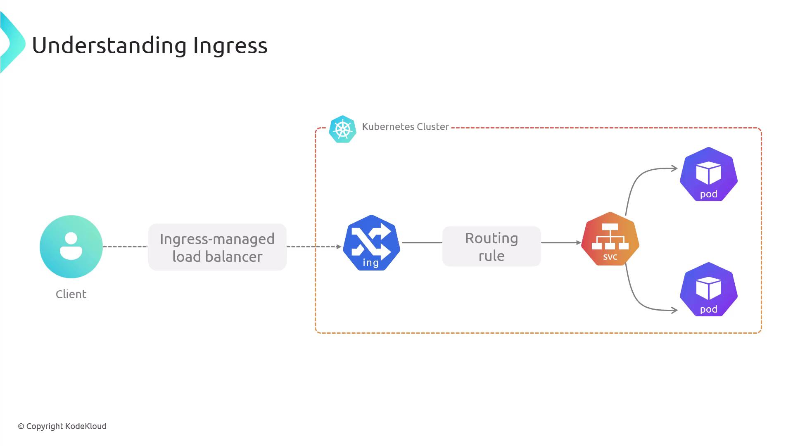
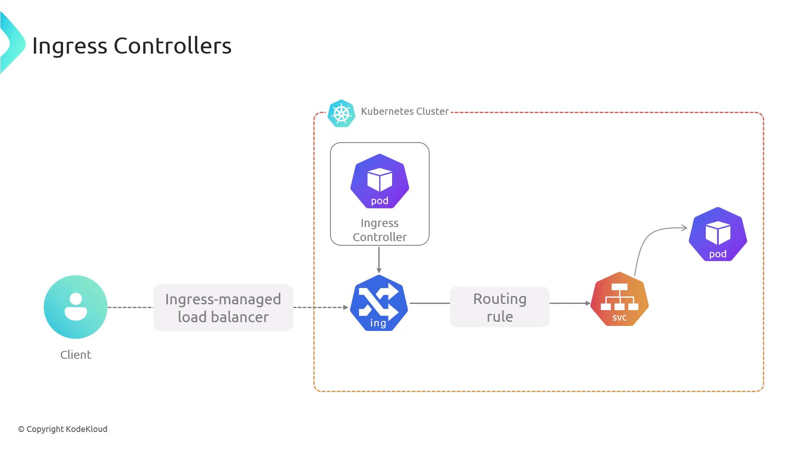
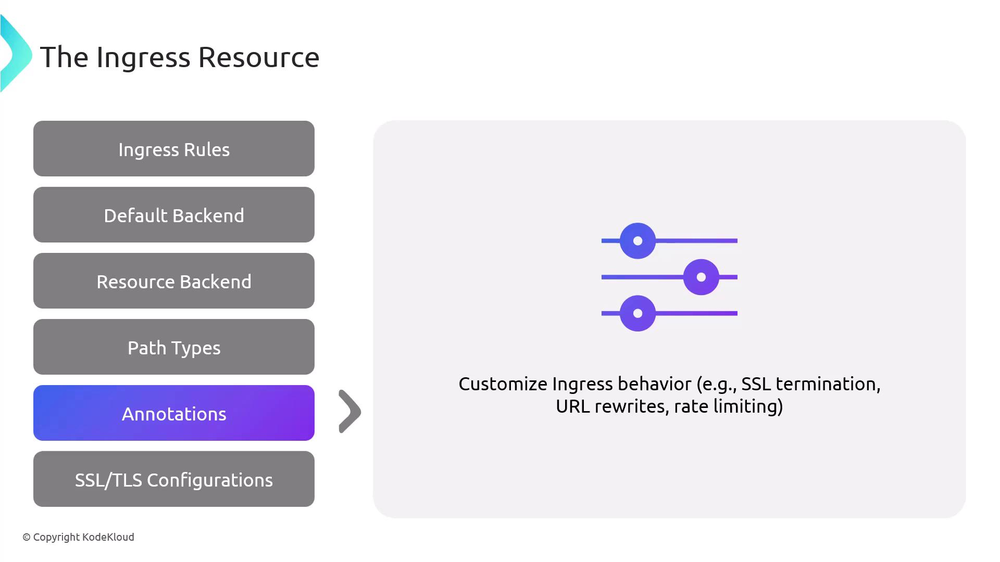

This article provides an overview of Kubernetes Ingress, detailing its role in routing external traffic to services within a cluster.

Accessing applications from outside a Kubernetes cluster is essential for serving users at scale (в масштабе всего кластера). Kubernetes uses an abstraction called **Ingress** to route external HTTP/HTTPS traffic to services within the cluster. By defining hostname- and path-based rules, Ingress acts as a reverse proxy or load balancer, enabling:

- Multiple services under a single IP
- SSL/TLS termination at the edge
- Name-based virtual hosting

<br>

Creating an `Ingress` resource has no effect until you deploy an **Ingress Controller**, which watches those resources and configures the edge component - such as Nginx or a cloud load balancer - to implement your routing rules.

<br>

Ingress Controllers run as pods in your cluster, providing scalability and self-healing. Many offer SSL/TLS termination, authentication, and DNS integration. Some popular controllers include:

| Controller | Features |
| ----------- | ----------- |
| NGINX Ingress Controller | Widely adopted (распространен), rich annotation support |
| Traefik | Dynamic configuration, Let's Encrypt |
| HAProxy Ingress | High performance, advanced routing rules |

Cloud platforms like AWS, GKE, and AKS also provide managed controllers that integrate with their load balancers and DNS services.

### Ingress vs. Service

| Aspect | Service (`NodePort`/`LoadBalancer`) | Ingress |
| ----------- | ----------- | ----------- |
| Protocols | TCP/UDP, HTTP | HTTP/HTTPS only |
| Port Exposure | Arbitrary (произвольные) ports | Ports 80 and 443 |
| Routing | None | Host- and path-based |
| TLS Termination | Not supported | Built-in at the edge |
| Virtual Hosting | No | Name-based |

Services are straightforward to configure, but Ingress provides greater control over HTTP traffic management, security, and virtual hosting.

### Anatomy of an Ingress Resource

An Ingress resource uses the standard Kubernetes schema: `apiVersion`, `kind`, `metadata`, and `spec`. Key spec fields include:

1. Ingress Rules
2. Default Backend
3. Resource Backend
4. Path Types
5. Annotations
6. TLS Configuration
​
#### 1. Ingress Rules

Rules map hostnames and URL paths to specific services and ports. You can route different paths or domains to separate backends.

<br>
​
#### 2. Default Backend

The default backend handles requests that don't match any rule, forwarding them to a specified service and port.

<br>

#### 3. Resource Backend

You can reference another Kubernetes resource (in the same namespace) instead of a service. Mixing `service` and `resource` in the same backend is invalid.

Resource backends were supported in earlier APIs (e.g., `networking.k8s.io/v1beta1`) but are not part of the current `networking.k8s.io/v1` spec. Controller support varies.

<br>
​
#### 4. Path Types

Path types determine how the Ingress Controller matches request URLs:

| Path Type | Behavior |
| ----------- | ----------- |
| Exact | Matches the full path exactly |
| Prefix | Matches based on the URL prefix |
| ImplementationSpecific | Controller-defined matching logic |

<br>
​
#### 5. Annotations

Annotations enable controller-specific features like SSL redirection, URL rewrites, or rate limiting.

<br>
​
#### 6. TLS Configuration

Specify TLS by referencing Kubernetes Secrets that store certificates and private keys. This configures HTTPS at the Ingress gateway.

<br>
​
### Minimal Ingress Example

This example defines a `defaultBackend` for unmatched requests and a rule that routes `example.com/web*` (prefix match) to `web-service:80`.

```yaml
apiVersion: networking.k8s.io/v1
kind: Ingress
metadata:
  name: example-ingress
  namespace: default
spec:
  defaultBackend:
    service:
      name: default-service
      port:
        number: 80
  rules:
  - host: "example.com"
    http:
      paths:
      - path: /web
        pathType: Prefix
        backend:
          service:
            name: web-service
            port:
              number: 80
```

All traffic not matching `/web` is sent to `default-service:80`.
​
### Common Ingress Patterns

- **Single-Service Ingress**: Routes all traffic to one backend.
- **Simple Fan-Out (веер)**: Path-based routing to multiple services.
- **Name-Based Virtual Hosting**: Hostname-based routing for multiple domains.
- **TLS/SSL Termination**: Decrypts HTTPS at the edge and forwards HTTP to services.

Controller support and advanced features may vary. Use annotations or Custom Resource Definitions (CRDs) to extend behavior.
​
### Key Benefits of Ingress

<br>

- Centralized traffic management through a single entry point
- Simplified certificate handling with edge SSL/TLS termination
- Flexible path- and host-based routing for complex architectures
- Auto-scaling and high availability via Kubernetes controllers
- Native integration with cloud load balancers, DNS, and managed certificates

Ingress gives you powerful, centralized control over external HTTP/HTTPS access to your Kubernetes workloads.