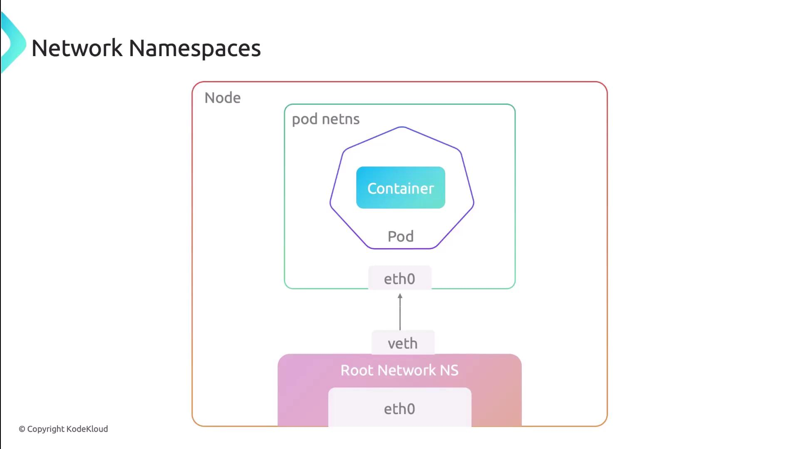

Networking (сетевые возможности) is a foundational (основополагающий) aspect of Kubernetes, enabling seamless communication between pods, services, and nodes - both inside and outside (как внутри так и за пределами) a cluster. Mastering (освоение) Kubernetes networking ensures your containerized applications run efficiently, scale effectively, and remain manageable.

### Kubernetes Networking Model

Kubernetes adopts (использует) a flat (плоский), unified network approach based on these core principles:

- Every pod gets a unique, cluster-wide IP address (the **IP-per-pod** model).
- Pods can communicate with any other pod on any node without Network Address Translation (NAT).
- Agents (like the kubelet) on each node can reach all pods on that node.

#### IP-per-Pod Explained

Think of each pod as a micro-VM: it receives its own IP address, allowing direct pod-to-pod connectivity across the cluster - just like virtual machines in a traditional network.

### Network Namespace in Pods

All containers in a pod share the same network namespace, meaning:

- One IP and one MAC address per pod.
- Shared interfaces, routing tables, firewall rules, and sockets.
- Intra-pod communication over `localhost`.

 

### Four Core Networking Challenges

Kubernetes addresses these four networking scenarios:

| Communication Type | Description |
| ----------- | ----------- |
| Container-to-Container | Within the same pod via shared `localhost`. |
| Pod-to-Pod | Across nodes using pod IPs - no NAT required. |
| Pod-to-Service | Pods reach a stable Virtual IP (ClusterIP) for services. |
| External-to-Service | External clients access `NodePort` or `LoadBalancer`. |

Each resource type uses distinct IP ranges to avoid conflicts:

| Resource Type | IP Assignment Source |
| ----------- | ----------- |
| Pod | CNI plugin-allocated from predefined pod CIDR pools |
| Service | kube-apiserver assigns cluster IPs from service CIDR |
| Node | Provided by infrastructure (DHCP, static, cloud APIs) |

#### IP Range Overlaps

Ensure your pod CIDR and service CIDR do not overlap with each other or your physical network to prevent routing issues.

### Implementing the Networking Model with CNI

Kubernetes relies on the **Container Network Interface (CNI)** to provision and configure pod networking. The kubelet invokes a CNI plugin to:

- Create and manage virtual network interfaces (`veth`, `macvlan`, etc.)
- Allocate and assign pod IP addresses
- Program routes and firewall (iptables) rules
- Tear down (разрушает) networks when pods terminate

### Comparing Popular CNI Plugins

| Plugin | Use Case | Key Features |
| ----------- | ----------- | ----------- |
| Calico | Enterprise network policy & security | BGP routing, NetworkPolicy, IP-in-IP overlay |
| Flannel | Simple pod overlay networking | VXLAN, host-gateway modes |
| Weave | Easy mesh networking | Automatic mesh, encryption, DNS service discovery |
| Cilium | High-performance, eBPF-based | eBPF datapath, Kubernetes NetworkPolicy, Load Balancing |