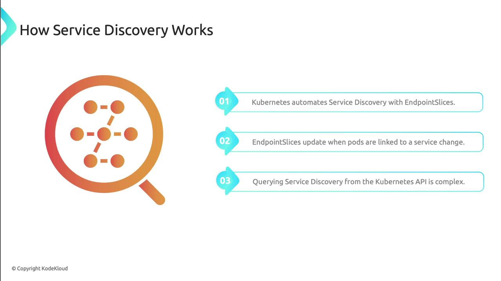

Service discovery ensures that microservices within a Kubernetes cluster can locate and communicate with each other without hard-coding IP addresses or hostnames. Kubernetes automates this process using environment variables and DNS, backed by (при поддержке) EndpointSlices that track pod membership.

### How Service Discovery Works

When pods are created, scaled, or terminated, Kubernetes updates EndpointSlices to record which pods back (поддерживают) each Service. Although you can query these slices via the API server, Kubernetes provides higher-level abstractions to hide this complexity.

<br>

## Service Discovery Mechanisms

| Mechanism | Description | Pros | Cons |
| ----------- | ----------- | ----------- | ----------- |
| Environment Variables | Kubelet injects service host/port as env vars | Immediate access <br> Zero additional deps | Static at pod start <br> Namespace-scoped |
| DNS | CoreDNS (or kube-dns) auto-creates service records | Dynamic updates <br> Cross-namespace | Requires DNS service <br> Potential lookup latency |

### Environment Variables

When a pod is launched, the Kubelet generates environment variables for each Service in the same namespace. These include the service's ClusterIP, ports, and protocol:

```
MY_APP_SERVICE_HOST=10.0.0.11
MY_APP_SERVICE_PORT=80
MY_APP_PORT=tcp://10.0.0.11:80
MY_APP_PORT_80_TCP=tcp://10.0.0.11:80
MY_APP_PORT_80_TCP_PROTO=tcp
MY_APP_PORT_80_TCP_PORT=80
MY_APP_PORT_80_TCP_ADDR=10.0.0.11
```

Example Service manifest that produces these variables:

```yaml
apiVersion: v1
kind: Service
metadata:
  name: my-app
spec:
  selector:
    app: my-app
  ports:
  - protocol: TCP
    name: my-app
    port: 80
    targetPort: 80
  type: ClusterIP
```

Service names are uppercased and dashes become underscores when generating environment variables. The Service must exist before the pod starts, since variables are injected at launch time.

### DNS-Based Service Discovery

Deploy a DNS add-on (e.g., CoreDNS) to enable DNS lookups for Services. CoreDNS watches the Kubernetes API and automatically creates DNS records whenever Services change.

#### DNS Records

By default, Kubernetes creates both A and SRV records for each Service:

```
A record:
my-app.default.svc.cluster.local

SRV record:
_my-app._tcp.my-app.default.svc.cluster.local
```

Both records resolve to the service's ClusterIP.

#### Shortened DNS Names

Depending on the client's namespace and search path, you can drop portions of the full DNS name:

- Outside the namespace: `my-app.default`
- Inside the namespace: `my-app`

The pod's `/etc/resolv.conf` (configured by the kubelet) controls this:

```
search backup-system.svc.cluster.local svc.cluster.local cluster.local
nameserver 10.96.0.10
options ndots:5
```

DNS resolution first tries the pod's namespace domain, then `svc.cluster.local`, and finally `cluster.local`.

**Warning**

If `ndots` is set too low, lookups may skip qualified names. Ensure `options ndots:5` (or higher) to allow short names in-cluster.