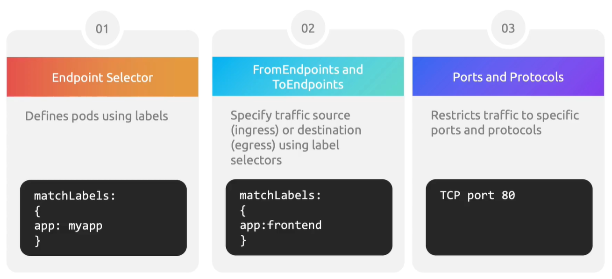
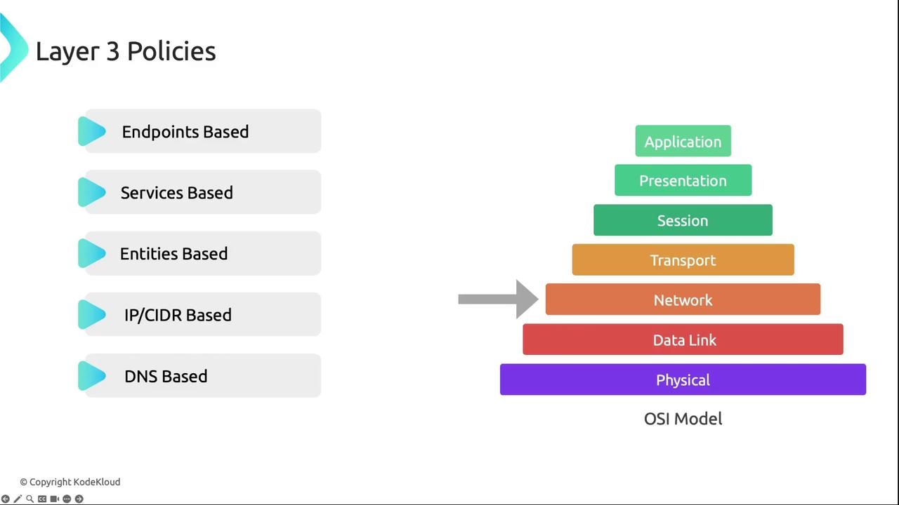

This article provides an overview of CNI network policies in Kubernetes, detailing their benefits, enforcement modes, and examples for traffic control and security.

### Recap of Kubernetes Network Policies

By default, Kubernetes pods communicate without restrictions, which can expose applications to unintended traffic flows. Implementing network policies allows you to explicitly permit or deny traffic between:

- Pod-to-Pod
- Pod-to-Service
- Pod-to-Namespace

**Network policies enhance cluster security by defining clear ingress and egress rules. Always start with a default deny posture in production.**

<br>

### Built-In vs. CNI-Specific Network Policies

Kubernetes ships with basic network policy support, but many CNI plugins extend capabilities with advanced features:

| Feature                        | Built-In Policy | CNI Plugin Extensions             |
| ------------------------------ | --------------- | --------------------------------- |
| Layer 7 Filtering              | N/A             | HTTP, gRPC, Kafka rules           |
| Encryption & Segmentation      | N/A             | mTLS, IPsec                       |
| Rate Limiting & Whitelisting   | N/A             | IP whitelisting/blacklisting, QoS |
| Traffic Monitoring & Analytics | Limited         | Real-time metrics & logs          |
| Multi-Cluster Policy Scope     | N/A             | Global policy management          |

### Key Benefits of CNI Network Policies

| Benefit                  | Description                                                   |
| ------------------------ | ------------------------------------------------------------- |
| Advanced Traffic Control | Fine-grained L3-L7 rules across pods, nodes, external targets |
| Enhanced Security        | Intrusion detection, IP whitelisting, rate limiting           |
| Performance Optimization | Low-latency, high-throughput networking                       |
| Extended Scope           | Policy enforcement beyond cluster boundaries                  |
| Customization            | Organization-specific rule definitions                        |
| Segmentation & QoS       | Network isolation plus traffic prioritization                 |
| Real-Time Monitoring     | Anomaly detection and live metrics                            |

### Cilium: Our CNI of Choice

Cilium leverages eBPF for efficient enforcement of Layer 3, 4, and 7 policies with minimal performance overhead:

- Layer 7 Visibility (HTTP, gRPC, Kafka)
- Protocol-Aware Filtering (methods, paths, headers)
- Service Mesh Integrations ([Istio](https://istio.io), [Linkerd](https://linkerd.io))
- Multi-Cluster Policy Consistency
- Rich eBPF-Powered Troubleshooting & Metrics

### Policy Enforcement Modes

Cilium follows a whitelist model. Traffic is dropped by default unless permitted by one of these modes:

- **Ingress Policies:** Allow traffic into pods based on source IPs, ports, or L7 rules
- **Egress Policies:** Allow pods to initiate traffic to specified destinations
- **Default Deny:** Any traffic not explicitly allowed will be blocked

### Rule Structure

Every Cilium policy uses an endpoint selector to target pods via labels:

```yaml
endpointSelector:
  matchLabels:
    app: myapp
```

Subsequent rule sections can include:

- `fromEndpoints` / `toEndpoints`: Label selectors for source/destination pods
- `ports` & `protocols`: Restrict to TCP/UDP ports
- Layer 7 rules: HTTP methods, paths, headers
- CIDR blocks: Allow or exclude specific IP ranges

<br>

<br>

#### Example: Comprehensive CiliumNetworkPolicy (L3–L7)

```yaml
apiVersion: "cilium.io/v2"
kind: CiliumNetworkPolicy
metadata:
  name: "example-policy"
spec:
  endpointSelector:
    matchLabels:
      app: myapp
  ingress:
  - fromEndpoints:
    - matchLabels:
        app: frontend
    toPorts:
    - ports:
      - port: "80"
        protocol: TCP
      rules:
        http:
        - method: "GET"
          path: "/public"
  egress:
  - toEndpoints:
    - matchLabels:
        app: database
    toPorts:
    - ports:
      - port: "3306"
        protocol: TCP
```

- **Ingress:** Only HTTP GET on `/public` from pods with `app=frontend`.
- **Egress:** Only TCP port 3306 to pods with `app=database`.

### Layer 3 Policies

Layer 3 policies define network-layer connectivity without deep packet inspection:

- **Endpoints-based:** Select pods by labels
- **Services-based:** Промежуточный метод между Endpoints-based и CIDR-based, использует концепцию K8s Services.
- **Entities-based:** Match built-in identities (идентификаторы) like `host` or `world`
- **IP/CIDR-based:** 
- **DNS-based:** Use runtime-resolved DNS names (honoring (с учётом значений) TTLs)

<br>

#### Examples

```yaml
# 1. Allow ingress from frontend pods to backend pods
apiVersion: "cilium.io/v2"
kind: CiliumNetworkPolicy
metadata:
  name: layer3-ingress-only
spec:
  endpointSelector:
    matchLabels:
      role: backend
  ingress:
  - fromEndpoints:
    - matchLabels:
        role: frontend
```

```yaml
# 2. Allow egress to specific CIDRs, excluding cluster service CIDR
apiVersion: "cilium.io/v2"
kind: CiliumNetworkPolicy
metadata:
  name: layer3-egress-cidr
spec:
  endpointSelector:
    matchLabels:
      role: backend
  egress:
  - toCIDR:
    - "20.1.1.1/32"
  - toCIDRSet:
    - cidr: "10.0.0.0/8"
      except:
      - "10.96.0.0/12"
```

### Layer 4 Policies

Layer 4 rules govern (регулирует) transport-layer connectivity (TCP/UDP). By default, Cilium blocks ICMP unless explicitly permitted.

<br>

#### Example: Restrict Egress to TCP Port 80

```yaml
apiVersion: "cilium.io/v2"
kind: CiliumNetworkPolicy
metadata:
  name: layer4-example
spec:
  endpointSelector:
    matchLabels:
      app: myService
  egress:
  - toPorts:
    - ports:
      - port: "80"
        protocol: TCP
```

This policy permits only TCP traffic on port 80 for pods labeled `app=myService`.

### Layer 7 Policies

Layer 7 policies enable application-layer inspection and enforcement for HTTP, gRPC, Kafka, and more.

<br>

#### Example: HTTP Methods, Paths & Headers

```yaml
apiVersion: "cilium.io/v2"
kind: CiliumNetworkPolicy
metadata:
  name: layer7-example
spec:
  endpointSelector:
    matchLabels:
      app: myService
  ingress:
  - toPorts:
    - ports:
      - port: "80"
        protocol: TCP
    rules:
      http:
      - method: GET
        path: "/path1$"
      - method: PUT
        path: "/path2$"
        headers:
        - "X-My-Header: true"
```

This policy allows:

- HTTP GET requests to `/path1`
- HTTP PUT requests to `/path2` only if `X-My-Header: true` is present

### Namespace vs. Cluster-Wide Policies

Cilium supports two scope levels:

| Resource Type                  | Scope            |
| ------------------------------ | ---------------- |
| CiliumNetworkPolicy            | Single Namespace |
| CiliumClusterwideNetworkPolicy | All Namespaces   |

**Combining namespace-specific and cluster-wide policies ensures both granular control and consistent, global security enforcement.**

<br>