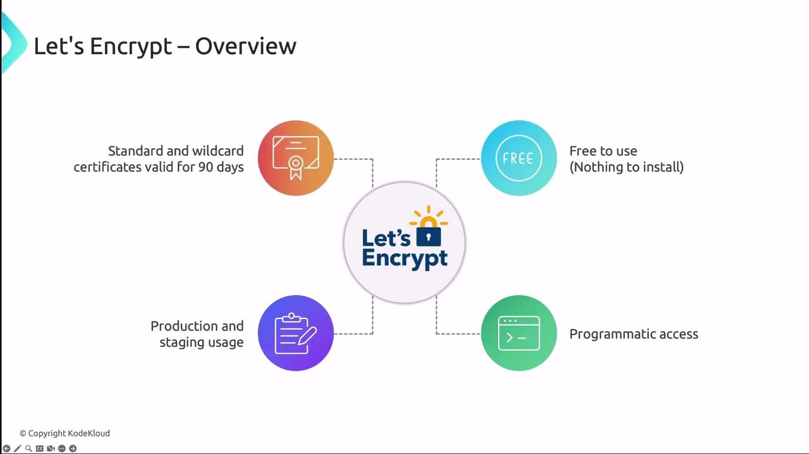

In this guide, you'll learn how to use cert-manager and Let's Encrypt together to automate SSL/TLS certificate management in Kubernetes. We'll cover:

1. What cert-manager is and how to install it.
2. An introduction to Let's Encrypt and its ACME workflow.
3. How to integrate cert-manager with Let's Encrypt for automatic certificate issuance and renewal.

### What Is cert-manager?

cert-manager is an open-source Kubernetes add-on that automates the issuance, renewal, and management of TLS certificates. It supports multiple issuers - such as Let's Encrypt, HashiCorp Vault, and self-signed certificates - and integrates seamlessly with Kubernetes resources like Ingress.

Key features include:

- Automated certificate requests & renewals
- Support for standard, wildcard, and self-signed certificates
- Kubernetes-native CRDs: Issuer, ClusterIssuer, and Certificate
- Secrets storage for TLS key/cert pairs

#### cert-manager Architecture

cert-manager runs as a set of controllers that watch CRDs and reconcile (согласовывает) the desired certificate state. Each controller interacts with the Kubernetes API to request, store, and renew certificates.

<br>

Table: cert-manager CRDs at a glance (с первого взгляда, краткий обзор)

| CRD           | Scope      | Purpose                                                |
| ------------- | ---------- | ------------------------------------------------------ |
| Issuer        | Namespaced | Defines how to request certificates within a namespace |
| ClusterIssuer | Cluster    | Defines certificate requests at the cluster level      |
| Certificate   | Namespaced | Specifies desired certificate, secret name, and DNS    |

When an Issuer or ClusterIssuer is created, cert-manager requests a certificate from the configured CA, then stores the key and certificate in a Kubernetes Secret. Controllers monitor expiry dates and perform automatic renewals.

<br>

**cert-manager can issue both standard and wildcard certificates. Use wildcard certificates to secure multiple subdomains with a single certificate.**

### Installing cert-manager

The easiest way to install cert-manager and its CRDs is with Helm:

```bash
$ helm repo add jetstack https://charts.jetstack.io
$ helm repo update
$ helm install cert-manager jetstack/cert-manager \
    --namespace cert-manager \
    --create-namespace \
    --version <VERSION> \
    --set installCRDs=true
```

Alternatively, install via `kubectl`:

```bash
$ kubectl apply -f https://github.com/jetstack/cert-manager/releases/download/<VERSION>/cert-manager.yaml
```

**Always match the `<VERSION>` placeholder with the latest stable release from the [cert-manager GitHub releases](https://github.com/jetstack/cert-manager/releases).**

For diagnostics and manual operations, use `cmctl`:

```bash
# Verify installation
cmctl check api

# Inspect Issuer or Certificate resources
cmctl inspect issuer <name>

# Trigger a certificate renewal
cmctl renew <certificate-name>
```

### Let's Encrypt Overview

Let's Encrypt is a free, automated, and open certificate authority (CA) that uses the ACME protocol to issue SSL/TLS certificates. It empowers (расширяет возможности) Kubernetes users to secure applications without manual certificate provisioning.

<br>

Key points about Let's Encrypt:

- Certificates are valid for 90 days.
- Offers **Production** and **Staging** endpoints.
- ACME challenges: HTTP-01 or DNS-01.
- Publicly logged for transparency (прозрачности).

Table: Let's Encrypt Endpoints

| Environment | ACME Endpoint | Use Case |
| ----------- | ------------- | -------- |
| Staging | https://acme-staging-v02.api.letsencrypt.org/directory | Testing automation workflows |
| Production | https://acme-v02.api.letsencrypt.org/directory | Live environments |

The ACME flow:

1. Client generates a key pair and creates a `CertificateRequest`.
2. Let's Encrypt returns an HTTP-01 or DNS-01 challenge.
3. Client fulfills the challenge by serving a token or adding a DNS record.
4. After validation, Let's Encrypt issues the certificate.
5. Client fetches and stores the certificate in Kubernetes.

<br>

### Integrating cert-manager with Let's Encrypt

To use Let's Encrypt as your certificate authority, define an Issuer or ClusterIssuer in cert-manager.

#### Example: Staging Issuer

```yaml
apiVersion: cert-manager.io/v1
kind: Issuer
metadata:
  name: letsencrypt-staging
spec:
  acme:
    server: https://acme-staging-v02.api.letsencrypt.org/directory
    email: your-email@example.com
    privateKeySecretRef:
      name: letsencrypt-staging
    solvers:
    - http01:
        ingress:
          class: nginx
```

**When moving to production, update the `server` URL to the production ACME endpoint and rename secrets accordingly.**

#### Configuring Kubernetes Ingress

Annotate your Ingress resource to reference the Issuer and specify TLS settings:

```yaml
apiVersion: networking.k8s.io/v1
kind: Ingress
metadata:
  name: web-ingress
  annotations:
    cert-manager.io/issuer: letsencrypt-staging
spec:
  tls:
  - hosts:
    - example.com
    secretName: web-tls
  rules:
  - host: example.com
    http:
      paths:
      - path: /
        pathType: Prefix
        backend:
          service:
            name: web
            port:
              number: 80
```

When this Ingress is applied, cert-manager handles ACME challenges, retrieves the certificate, and stores it in the `web-tls` Secret. Certificates are renewed automatically before expiration.