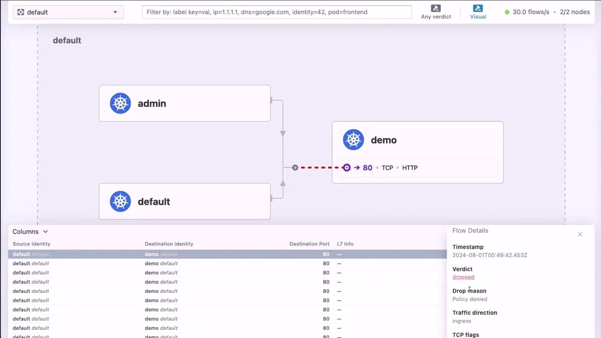

This article provides a guide on setting up Cilium Hubble for metrics, monitoring, and visibility in a Kubernetes environment.

### Prerequisites

- A running Kubernetes cluster with Cilium installed (v1.15.3 or later).
- Prometheus and Grafana deployed in the `cilium-monitoring` namespace.

**Hubble components (Relay, UI, metrics) are disabled by default. You must enable them via Helm to collect and visualize network flows.**


### 1. Verify Cilium and Hubble Status

First, confirm Cilium is healthy and Hubble is not yet active:

```bash
$ cilium status
    /¯¯\
 /¯¯\__/¯¯\    Cilium:             OK
 \__/¯¯\__/    Operator:           OK
 /¯¯\__/¯¯\    Envoy DaemonSet:    disabled (using embedded mode)
 \__/¯¯\__/    Hubble Relay:       disabled
    \__/       ClusterMesh:        disabled

DaemonSet              cilium                   Desired: 2, Ready: 2/2, Available: 2/2
Deployment             cilium-operator          Desired: 1, Ready: 1/1, Available: 1/1
Containers:            cilium                   Running: 2
                       cilium-operator          Running: 1
                       clustermesh-apiserver
                       hubble-relay
Cluster Pods:          6/6 managed by Cilium
Helm chart version:    1.15.3
```

Установка Prometheus:

```bash
# Создаем namespace:
$ kubectl create namespace monitoring
# Добавляем репозиторий с чартами:
$ helm repo add prometheus-community https://prometheus-community.github.io/helm-charts
$ helm repo update
$ helm search repo prometheus-community
# Устанавливаем:
$ helm install prometheus prometheus-community/kube-prometheus-stack --namespace monitoring
```

Установка Grafana:

```bash
# Добавляем репозиторий с чартами:
$ helm repo add grafana https://grafana.github.io/helm-charts
$ helm repo update
$ helm search repo grafana/grafana
# Устанавливаем:
$ helm install grafana grafana/grafana --namespace monitoring
# Смотрим notes чарта:
$ helm get notes grafana -n monitoring
# Смотрим пароль администратора:
$ kubectl -n monitoring get secret grafana -o jsonpath='{.data.admin-password}' | base64 -d ; echo
```

Verify that Grafana and Prometheus are up but not receiving Hubble metrics:

```bash
$ kubectl -n cilium-monitoring get all
NAME                           READY   STATUS    RESTARTS   AGE
pod/grafana-xxx                1/1     Running   0          10m
pod/prometheus-yyy             1/1     Running   0          10m

NAME                TYPE       CLUSTER-IP      PORT(S)
service/grafana     NodePort   10.98.81.88     3000:32000/TCP
service/prometheus  ClusterIP  10.99.242.121   9090/TCP
```

Check that the Cilium Helm repo is configured:

```bash
$ helm repo list
NAME    URL
cilium  https://helm.cilium.io/
```

### 2. Enable Hubble Components

Upgrade your Cilium installation to enable Hubble Relay, UI, and Prometheus metrics:

```bash
$ helm repo add cilium https://helm.cilium.io/
$ helm upgrade cilium cilium/cilium --version 1.15.4 \
    --namespace kube-system \
    --reuse-values \
    --set hubble.enabled=true \
    --set hubble.relay.enabled=true \
    --set hubble.ui.enabled=true \
    --set hubble.metrics.enableOpenMetrics=true \
    --set prometheus.enabled=true \
    --set operator.prometheus.enabled=true \
    --set hubble.metrics.enabled="{dns,drop,tcp,flow,port_distribution,icmp,httpV2:exemplars=true;labelsContext=source_ip,source_namespace,destination_ip,destination_namespace,destination_workload,traffic_direction}"
```

С неправильным списком метрик (как в примере выше) pod `cilium-agent` поднимается, но в логах можно найти ошибку про Metrics Server и в итоге не слушается hostPort 4244, из-за этого не поднимается `hubble-relay`.

Про hostNetwork и hostPort. Если в манифесте присутствует параметр `hostNetwork: true`, то подразумевается, что и hostPort-ы тоже "в деле". Если не указаны значения для hostPort-ов, но указаны для значения для containerPort-ов, то подразумевается, что `hostPort = containerPort`.

| Metric Type          | Description                                   |
| ---------------------| --------------------------------------------- |
| `dns`                | DNS query and response details                |
| `drop`               | Packets dropped by policy or misconfiguration |
| `tcp`, `icmp`        | L4 protocol-specific flow statistics          |
| `port_distribution`  | Top ports by traffic volume                   |
| `httpV2`             | HTTP/2 requests and response summaries        |

After a minute, confirm that Hubble Relay and UI are healthy:

```bash
$ cilium status
...
Hubble Relay:    OK
Hubble UI:       OK
```

### 3. View Hubble Metrics in Grafana

Navigate to the Grafana dashboard in the `cilium-monitoring` namespace. You should see Hubble flow metrics such as flows per node, dropped vs forwarded traffic, and protocol distribution:

<br>

### 4. Expose the Hubble UI as NodePort

By default, the Hubble UI service is `ClusterIP`. Edit it to use a NodePort for external access:

```bash
$ kubectl -n kube-system edit svc hubble-ui
```

Replace the spec with:

```yaml
apiVersion: v1
kind: Service
metadata:
  name: hubble-ui
  namespace: kube-system
spec:
  type: NodePort
  ports:
  - name: http
    port: 80
    targetPort: 8081
    nodePort: 30000
  selector:
    k8s-app: hubble-ui
```

**Exposing services via NodePort can open your cluster to external traffic. Ensure proper firewall rules or security groups are in place.**

Now you can access the Hubble UI at `<NodeIP>:30000`.

### 5. Test Network Flows with curl

We have a demo application offering two endpoints:

- `/api` – restricted to requests with header `X-API-KEY: abc123` from pods labeled `app=admin`.
- `/healthz` – open to all traffic.

Create a `CiliumNetworkPolicy` to enforce this:

```yaml
apiVersion: cilium.io/v2
kind: CiliumNetworkPolicy
metadata:
  name: demo-policy
  namespace: default
spec:
  endpointSelector:
    matchLabels:
      app: demo
  ingress:
  - fromEndpoints:
    - matchLabels:
        app: admin
    toPorts:
    - ports:
      - port: "80"
        protocol: TCP
      rules:
        http:
        - method: GET
          path: /healthz
        - method: GET
          path: /api
          headers:
          - X-API-KEY: abc123
```

Apply the policy and perform valid and invalid requests:

```bash
$ kubectl run --rm -i --tty admin-pod \
    --image=curlimages/curl \
    --labels=app=admin \
    --restart=Never -- \
    curl -H "X-API-KEY: abc123" http://app-svc-80/api
{"message":"Have a great day!","method":"GET","url":"/api"}
```

Invalid request (missing API key) will time out:

```bash
$ kubectl run --rm -i --tty admin-pod \
    --image=curlimages/curl \
    --restart=Never -- \
    curl http://app-svc-80/api --connect-timeout 2
curl: (28) Failed to connect to app-svc-80 port 80 after 2001 ms: Timeout was reached
```

#### Observe Metrics for Forwarded vs Dropped Flows

Return to Grafana to see the changes in the "Forwarded vs Dropped" panel and other flow statistics:

<br>

### 6. Visualize Live Flows in Hubble UI

Open the Hubble UI at `<NodeIP>:30000` to explore live network flows. Click on any flow to see detailed metadata and policy verdicts:

<br>

## 7. Using the Hubble CLI

You can also use the Hubble CLI for real-time troubleshooting. Exec into a Cilium agent pod:

```bash
$ kubectl -n kube-system exec -it cilium-xxxx -c cilium-agent -- /bin/bash
root@cilium# hubble version
hubble 0.13.2 compiled with go1.21.8 on linux/amd64

root@cilium# hubble status
Healthcheck (unix:///var/run/cilium/hubble.sock): Ok
Current/Max Flows: 4095/4095 (100.00%)
Flows/s: 4.77
```

Stream live flow logs:

```bash
root@cilium# hubble observe
Aug  1 00:52:09.273: 10.0.1.84:54976 <> kube-system/hubble-ui:8081 to-overlay FORWARDED (TCP SYN)
Aug  1 00:52:09.276: kube-system/hubble-ui:57128 -> kube-system/hubble-relay:4245 FORWARDED (TCP ACK, PSH)
```

Filter flows by namespace, pod, time range, or format:

```bash
# Only default namespace
root@cilium# hubble observe --namespace default

# From the admin pod
root@cilium# hubble observe --namespace default --from-pod admin

# Last 30 minutes
root@cilium# hubble observe --since 30m

# Follow live updates
root@cilium# hubble observe --follow

# JSON output
root@cilium# hubble observe -o json | jq .
[
  {
    "time": "2024-08-01T00:49:41.474560859Z",
    "source": {
      "pod": "admin",
      "namespace": "default"
    },
    "destination": {
      "pod": "demo-deployment-7ccd685fcc-6grkd",
      "namespace": "default",
      "port": 80
    },
    "Type": "L3_L4",
    "Summary": "TCP SYN"
  }
]
```

### Conclusion

Cilium Hubble delivers powerful network observability through both a rich UI and command-line interface. Integrate Hubble with Prometheus and Grafana for long-term monitoring or use the `hubble` CLI for on-the-fly troubleshooting.

```yaml
apiVersion: v1
kind: ConfigMap
metadata:
  name: nginx-config
data:
  nginx.conf: |
    server {
        listen 4244;
        listen [::]:4244;
        server_name localhost;
        location / {
            root /usr/share/nginx/html;
            index index.html index.htm;
        }
    }
---
apiVersion: v1
kind: Pod
metadata:
  name: nginx-pod-custom
spec:
  containers:
  - name: nginx
    image: nginx:latest
    ports:
    - containerPort: 4244
      hostPort: 4244
      name: peer-test
      protocol: TCP
    volumeMounts:
    - name: nginx-config-volume
      mountPath: /etc/nginx/conf.d/default.conf
      subPath: nginx.conf
  volumes:
    - name: nginx-config-volume
      configMap:
        name: nginx-config
```