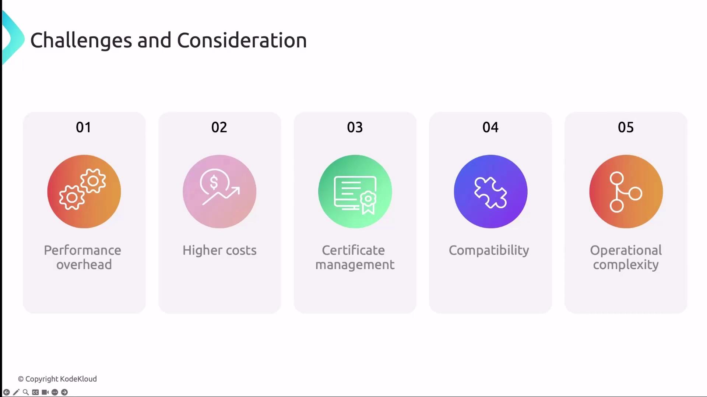

In this lesson, you'll learn the fundamentals of mutual TLS (mTLS) and how it enhances security for service-to-service communication in Kubernetes. Although we're not enabling mTLS on our Company X cluster right now, understanding these concepts is vital for any production-grade environment.

### What Is mTLS?

Mutual TLS (mTLS) is an extension of standard TLS that enforces authentication for both client and server using X.509 certificates. In a traditional TLS handshake:

1. Client sends a **Client Hello**.
2. Server responds with a **Server Hello** and presents its certificate.
3. Client verifies the server's certificate.

mTLS adds two more critical steps:

4. Client sends its own certificate to the server.
5. Server verifies the client's certificate.

This bidirectional verification ensures end-to-end encryption, prevents impersonation (выдача себя за другое лицо), and eliminates (исключает) man-in-the-middle attacks.

**Before deploying mTLS, ensure you have a Certificate Authority (CA) in place. Tools like [Cert-Manager](https://cert-manager.io/) can automate certificate issuance, rotation, and revocation.**

### How mTLS Works

The mTLS handshake extends the standard TLS flow with certificate exchange on both sides:

1. **Client Hello:** Client initiates the handshake.
2. **Server Hello + Certificate:** Server replies with its certificate.
3. **Server Verification:** Client validates the server's certificate against a trusted CA.
4. **Client Certificate:** Client presents its certificate to the server.
5. **Client Verification:** Server validates the client's certificate.
6. **Secure Channel Established:** Both parties exchange encrypted data over the secure channel.

 

### Key Benefits of mTLS in Kubernetes

| Benefit | Description |
| ------- | ----------- |
| Enhanced Security | Enforces mutual authentication to confirm both endpoints' identities. |
| Man-in-the-Middle Protection | Prevents interceptors from decrypting or spoofing (подмена) messages without valid certificates. |
| Data Integrity | Guarantees end-to-end encryption to protect confidentiality and message integrity. |
| Regulatory Compliance | Helps meet GDPR, HIPAA, PCI DSS, and other security standards. |
| Automated Certificate Management | Offloads cert lifecycle tasks (issuance, renewal, revocation) to tools like Cert-Manager. |
| Zero-Trust Alignment | Requires authentication for every connection, reinforcing a zero-trust security posture. |

### mTLS in Service Meshes

Several service meshes and CNI plugins offer built-in mTLS capabilities:

#### Linkerd

Linkerd injects a lightweight sidecar proxy into each pod to:

- Manage all inbound/outbound traffic.
- Perform mTLS handshakes automatically.
- Rotate short-lived certificates via its control plane.

#### Istio

Istio leverages Envoy sidecars:

- Istio's built-in CA issues and auto-rotates certificates.
- Sidecars exchange and verify credentials against the Istio root CA.
- Establish encrypted tunnels between services.

#### Cilium (Beta)

Cilium's mTLS support is currently in beta. Refer to the official [Cilium documentation](https://docs.cilium.io/) for setup instructions and caveats (предостережения).

### Best Practices for mTLS in Kubernetes

- Automate certificate lifecycle with [Cert-Manager](https://cert-manager.io/) or a similar tool.
- Deploy a service mesh (Istio, Linkerd) to simplify policy enforcement and certificate rotation.
- Integrate mTLS validation into CI/CD pipelines to catch misconfigurations early.
- Provide training and run regular workshops on certificate troubleshooting.
- Keep operational runbooks and troubleshooting guides up to date.

**mTLS adds CPU/memory overhead for encryption and certificate checks. Plan resource allocation accordingly.**

### Challenges and Considerations

1. Performance overhead from encryption/decryption and additional handshakes.
2. Increased infrastructure and tooling costs.
3. Complexity in configuring and managing certificates - even with automation.
4. Compatibility gaps (пробелы) in legacy or third-party services.
5. Operational complexity requiring deeper security expertise.

 