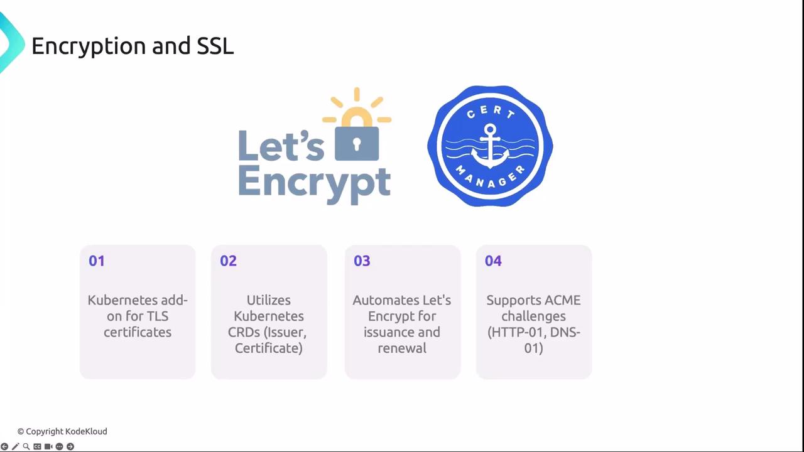
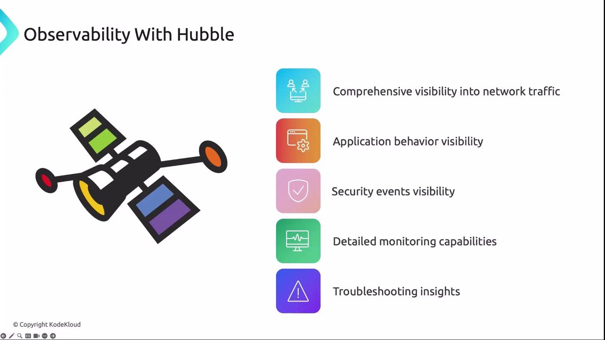

As Kubernetes scales to manage hundreds or thousands of containers across multiple nodes, securing your cluster becomes mission-critical. A single vulnerability can cascade (распространиться) through workloads, compromise sensitive data, or disrupt services. This guide outlines proven strategies - from TLS automation to network policies and observability - to strengthen (для усиления) your Kubernetes security posture (состояние).

| Section                      | Focus                       | Benefit                           |
| ---------------------------- | --------------------------- | --------------------------------- |
| 1. Encryption & SSL          | Automated TLS certificates  | Secure HTTPS endpoints            |
| 2. Securing Ingress          | Ingress controller security | Encrypted entry points            |
| 3. CNI Network Policies      | Pod network isolation       | Reduced lateral attack surface    |
| 4. Mutual TLS (mTLS)         | Service-to-service auth     | Prevent man-in-the-middle attacks |
| 5. Observability With Hubble | Traffic & event visibility  | Faster troubleshooting and alerts |

lateral - боковой, побочный

### 1. Encryption and SSL

Automating TLS certificate issuance (выпуск) and renewal is essential for 24/7 uptime and risk reduction (снижение). Let's Encrypt and cert-manager work together to keep your cluster's endpoints secure:

- **Let’s Encrypt** ([letsencrypt.org](https://letsencrypt.org/)) provides free SSL/TLS certificates via the ACME protocol.
- **cert-manager** ([cert-manager.io](https://cert-manager.io/)) automates certificate lifecycles using Kubernetes CRDs (`Issuer`, `ClusterIssuer`, `Certificate`).

```yaml
apiVersion: cert-manager.io/v1
kind: ClusterIssuer
metadata:
  name: letsencrypt-prod
spec:
  acme:
    server: https://acme-v02.api.letsencrypt.org/directory
    email: admin@example.com
    privateKeySecretRef:
      name: letsencrypt-prod-key
    solvers:
    - http01:
        ingress:
          class: traefik
---
apiVersion: cert-manager.io/v1
kind: Certificate
metadata:
  name: example-com-tls
spec:
  secretName: example-com-tls
  dnsNames:
  - example.com
  issuerRef:
    name: letsencrypt-prod
    kind: ClusterIssuer
```

**Make sure your DNS records are properly configured for HTTP-01 or DNS-01 challenges before deploying cert-manager.**

cert-manager stores issued certificates in Kubernetes Secrets and renews them automatically before expiration.

<br>

### 2. Securing Ingress

Exposed services must serve traffic securely. Traefik is a popular Ingress controller that integrates seamlessly with cert-manager and Let's Encrypt to automate SSL/TLS:

```yaml
apiVersion: traefik.containo.us/v1alpha1
kind: IngressRoute
metadata:
  name: secure-web
  annotations:
    cert-manager.io/cluster-issuer: letsencrypt-prod
spec:
  entryPoints:
  - websecure
  routes:
  - match: Host(`app.example.com`)
    kind: Rule
    services:
    - name: web
      port: 80
  tls:
    secretName: example-com-tls
```

With this configuration, Traefik delegates certificate requests to cert-manager, enabling HTTPS without manual steps.

### 3. CNI Network Policies

NetworkPolicies define traffic rules at the pod level, isolating workloads and preventing unauthorized lateral movement:

```yaml
apiVersion: networking.k8s.io/v1
kind: NetworkPolicy
metadata:
  name: allow-from-frontend
spec:
  podSelector:
    matchLabels:
      role: web
  ingress:
  - from:
    - podSelector:
        matchLabels:
          role: frontend
    ports:
    - protocol: TCP
      port: 80
```

#### Advanced Policies with Cilium

Cilium uses eBPF for kernel-level enforcement and richer (более точных) policy definitions:

```yaml
apiVersion: cilium.io/v2
kind: CiliumNetworkPolicy
metadata:
  name: allow-frontend-to-web
spec:
  endpointSelector:
    matchLabels:
      role: web
  ingress:
  - fromEndpoints:
    - matchLabels:
        role: frontend
    toPorts:
    - ports:
      - port: "80"
        protocol: TCP
```

### 4. Mutual TLS (mTLS)

Mutual TLS ensures both clients and servers verify each other's identity before exchanging data. This two-way authentication thwarts (препятствует) man-in-the-middle attacks and enforces strict service-level trust.

**Expired or misconfigured certificates will break mTLS connections. Monitor certificate lifecycles and automate renewals.**

### 5. Observability With Hubble

Cilium's Hubble provides deep visibility into network flows, application performance, and security events:

```bash
# Deploy Cilium with Hubble
$ kubectl apply -f https://raw.githubusercontent.com/cilium/cilium/v1.12/install/kubernetes/quick-install.yaml

# Enable Hubble metrics server
$ cilium hubble enable

# Observe live network flows
$ hubble observe --namespace default
```

<br>