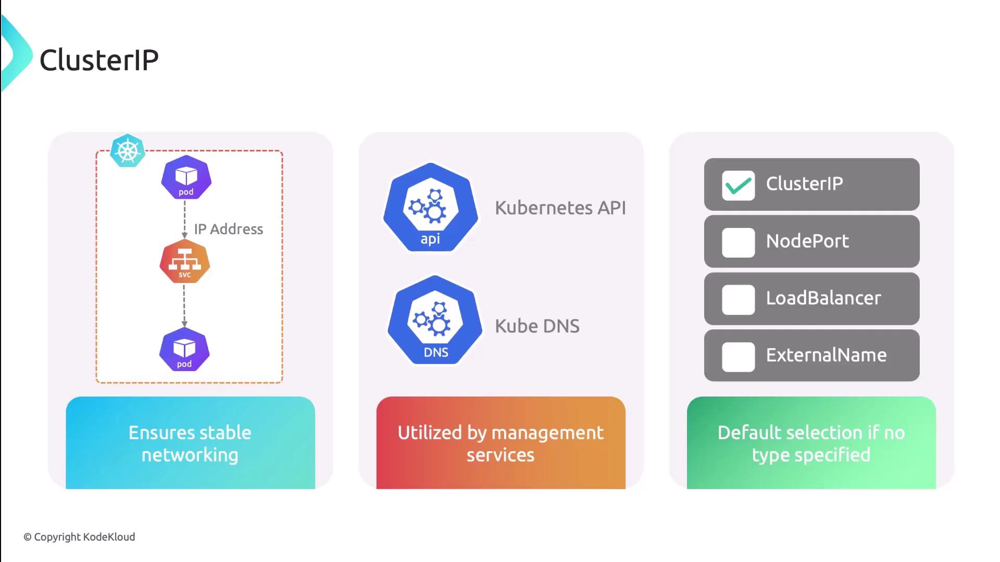
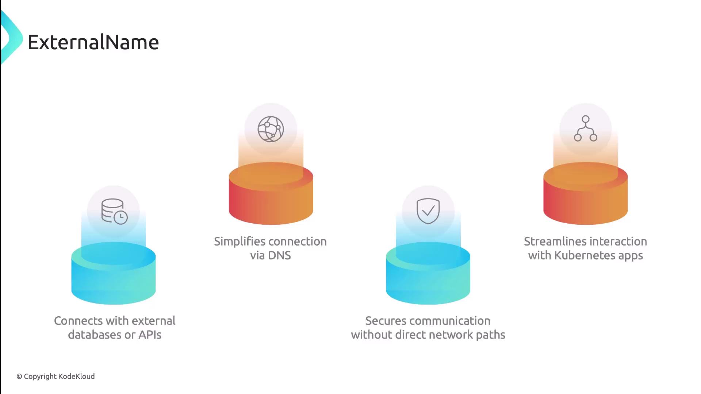
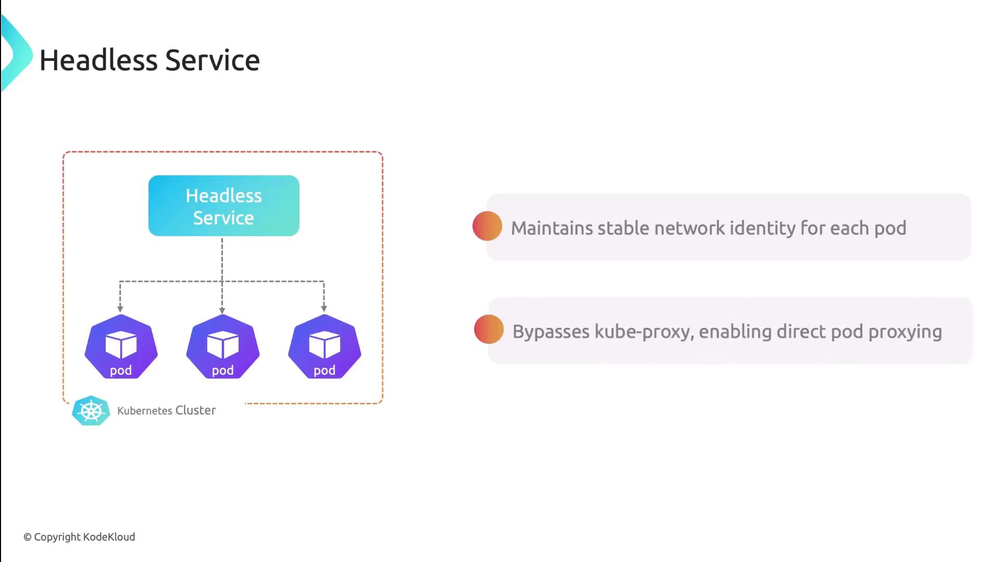

Kubernetes service types are powerful abstractions that expose applications running inside a cluster to both internal and external clients. Each service type determines how network traffic is routed to your pods. In this guide, we'll cover the four primary service types - ClusterIP, NodePort, LoadBalancer, and ExternalName - as well as Headless Services for direct pod addressing.

Every Service resource sets its type in `spec.type`. Use this template to get started:

```yaml
apiVersion: v1
kind: Service
metadata:
  name: my-service
spec:
  type: TYPE   # ClusterIP | NodePort | LoadBalancer | ExternalName
  selector:
    app: my-app
  ports:
  - protocol: TCP
    port: 80
    targetPort: 8080
```

### ClusterIP

ClusterIP is the default service type. It provisions a stable internal IP address, enabling reliable communication between pods and services within the cluster. Because it's not exposed externally, ClusterIP is ideal for backend components like databases, the Kubernetes API server, and DNS resolution.

```yaml
# ClusterIP example (default)
apiVersion: v1
kind: Service
metadata:
  name: internal-service
spec:
  selector:
    app: backend
  ports:
  - port: 5432
    targetPort: 5432
```

<br>

### NodePort

NodePort opens a static port (default range 30000–32767) on every node's IP address. Clients can reach your service using `<NodeIP>:<NodePort>`. This is useful for development or testing when you need quick external access without configuring a cloud load balancer.

```yaml
apiVersion: v1
kind: Service
metadata:
  name: my-nodeport-service
spec:
  type: NodePort
  selector:
    app: web
  ports:
  - name: http
    protocol: TCP
    port: 80
    targetPort: 80
    nodePort: 31000
```

**Warning**

Ensure your nodes' network security groups and firewalls allow traffic to the chosen `nodePort` range.

### LoadBalancer

LoadBalancer automatically provisions an external load balancer through your cloud provider. It allocates a public IP address and distributes incoming requests across your service's pods. This is the recommended approach for production workloads requiring high availability and scalability.

```yaml
apiVersion: v1
kind: Service
metadata:
  name: my-loadbalancer-service
spec:
  type: LoadBalancer
  selector:
    app: frontend
  ports:
  - port: 80
    targetPort: 8080
```

When using a cloud provider, ensure your Kubernetes cluster is configured with the appropriate CNI plugin to support load balancer integrations.

<br>

### ExternalName

ExternalName maps a Kubernetes service to an external DNS name. Instead of proxying through cluster networking, DNS queries resolve directly to the external hostname. Use this to integrate external APIs, databases, or SaaS offerings.

```yaml
apiVersion: v1
kind: Service
metadata:
  name: external-db
spec:
  type: ExternalName
  externalName: db.example.com
```

ExternalName services do not use selectors or ports. Kubernetes returns a CNAME record for DNS resolution.

<br>

### Headless Service

Headless Services omit the virtual IP by setting `clusterIP: None`. DNS queries return the pod IPs directly. This pattern is ideal for stateful applications like databases, message queues, and distributed systems requiring direct pod addressing.

```yaml
apiVersion: v1
kind: Service
metadata:
  name: headless-app
spec:
  clusterIP: None
  selector:
    app: stateful
  ports:
  - protocol: TCP
    port: 6379
    targetPort: 6379
```

<br>

### Comparison of Service Types

| Service Type | Exposure | Use Case |
| ----------- | ----------- | ----------- |
| ClusterIP | Internal only | Core services, internal APIs |
| NodePort | NodeIP:`nodePort` | Dev/testing, simple external access |
| LoadBalancer | Public IP via cloud LB | Production-grade external access |
| ExternalName | DNS CNAME | External dependencies (DBs, APIs) |
| Headless | Direct pod IPs (no VIP) | Stateful sets, direct pod communication |