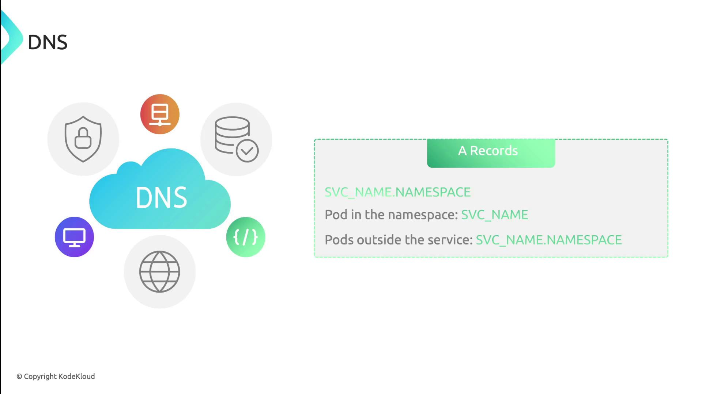

Kubernetes Services provide a stable network endpoint for pods, abstracting their dynamic IPs and ensuring consistent (согласованную) communication across the cluster.

A Service definition looks like any other Kubernetes object. You give it a name, set a selector for matching pods, declare ports, and choose a Service type:

```yaml
apiVersion: v1
kind: Service
metadata:
  name: my-service
  namespace: my-namespace
spec:
  selector:
    app: my-app
  ports:
  - protocol: TCP
    port: 80         # Service port
    targetPort: 8080 # Pod port
  type: ClusterIP
```

- selector: `app: my-app` matches pods labeled accordingly.
- ports: exposes port 80 and forwards traffic to pod port 8080.
- type: `ClusterIP` (default) makes the Service reachable only within the cluster.

Kubernetes uses EndpointSlices to track pod endpoints automatically. Clients always connect to the Service IP, unaware (не подозревая) of pod restarts or IP changes.

### Service Discovery

Kubernetes exposes Service endpoints to pods in two ways:

1. **Environment variables**

   The kubelet injects:

   - `MY_SERVICE_SERVICE_HOST`
   - `MY_SERVICE_SERVICE_PORT`

   into each container at startup.

2. **DNS**

   With CoreDNS (or another DNS add-on), every Service gets an A record and SRV records:

   - **A record**: `service-name.namespace.svc.cluster.local`
   - **SRV records**: one per named port, for example:

     `_http._tcp.my-service.my-namespace.svc.cluster.local`

<br>

### Service Types

Kubernetes supports four Service types, each controlling how traffic reaches your application.

| Service Type | Exposure Scope | Port Mapping |
| ClusterIP | Internal cluster only	Virtual cluster IP
| NodePort	Host nodes	NodeIP:NodePort
| LoadBalancer	External via LB	Provisioned cloud load balancer IP
| ExternalName	DNS redirection	CNAME record to external hostname