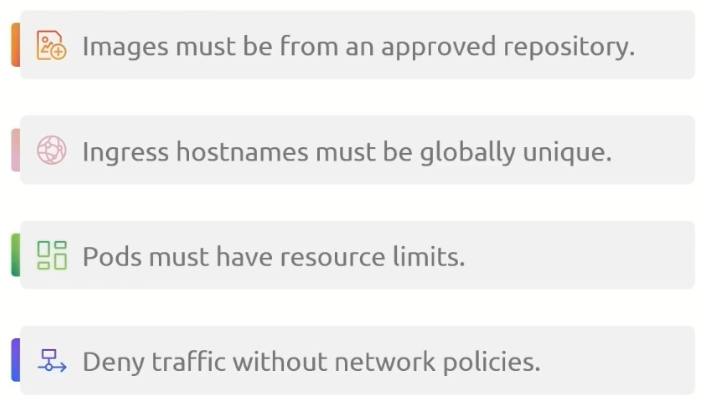
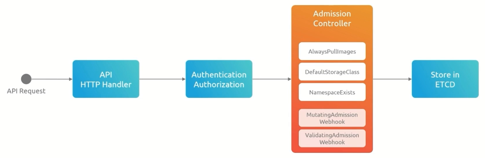
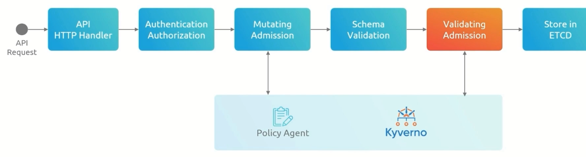

Для чего может понадобится Kyverno?

Изначально сам K8s не выполняет каких-либо validation checks над манифестами, кроме проверки корректности синтаксиса и наличия объекта с таким же именем (создать новый объект или изменить существующий).

И вот перед нами задача. Мы хотим быть уверены, что следуем лучшим практиками написания K8s-манифестов, а также соответствуем требованиям законодательства для конкретной индустрии. Попытки обеспечить подобное соответствие вручную часто подвержены ошибкам и полны разочарования.

К примеру мы хотим, чтобы у каждого манифеста проставлялся label с названием команды (team), которая написала этот манифест. Кроме того мы хотим запретить использование тэга `latest`.

Плюс ввести еще ряд ограничений:

<br>

Kyverno - это policy enforcement engine, который позволяет нам создавать различные правила/политики, которые обеспечивают соблюдение требуемых ограничений на конфигурацию объектов в кластере.

Если объект не удовлетворяет заданным политикам, то его создание будет отклонено.

Для начала вспомним какой путь проходит запрос после ввода команды `kubectl apply -f`.

<br>

Больше всего в этой цепочке нас интересует Admission Controller, который способен выполнять как валидацию, так и модификацию запросов. Функциональность Admission Controller расширяется различными плагинами.

Если у нас есть некое специфическое требование, под которое пока не существует нужного плагина, то мы можем задействовать функционал ValidatingAdmissionWebhook и MutatingAdmissionWebhook, которые в свою очередь могут вызывать какое-либо third-party решение с определенной логикой.

Как изменится схема прохождения запроса:

<br>

Теперь когда Admission Controller получает запрос, то на этапах Mutating Admission (изменение исходного запроса) и Validating Admission (проверка запроса) он будет обращаться к Kyverno с помощью настроенного webkook.

Установка Kyverno: https://kyverno.io/docs/installation/methods/

```shell
$ helm repo add kyverno https://kyverno.github.io/kyverno/
$ helm repo update
$ helm install kyverno kyverno/kyverno -n kyverno --create-namespace
```

Создадим простой Deployment:

```yaml
apiVersion: apps/v1
kind: Deployment
metadata:
  name: nginx-deployment
  labels:
    app: nginx
    # team: frontend
spec:
  replicas: 1
  selector:
    matchLabels:
      app: nginx
  template:
    metadata:
      labels:
        app: nginx
    spec:
      containers:
      - name: container1
        image: nginx
```

И политику Kyverno, которая требует наличия label с названием команды, создавшей манифест:

```yaml
apiVersion: kyverno.io/v1
kind: ClusterPolicy
metadata:
  name: require-deployment-team-label
spec:
  validationFailureAction: Enforce
  rules:
  - name: require-deployment-team-label
    match:
      any:
      - resources:
          kinds:
          - Deployment
    validate:
      message: "you must have label `team` for all deployments"
      pattern:
        metadata:
          labels:
            team: "?*"   # как минимум один символ в значении label "team"
```

Секция `validationFailureAction` может принимать следующие значения:
- `Audit` - в случае несоответствия заданным правилам создание ресурса разрешается, но будет создан специальный отчет
- `Enforce` - в случае несоответствия заданным правилам создание ресурса запрещается

The `validationFailureAction` attribute controls admission control behaviors for resources that are not compliant with a policy. If the value is set to `Enforce`, resource creation or updates are blocked when the resource does not comply. When the value is set to `Audit`, a policy violation is logged in a `PolicyReport` or `ClusterPolicyReport` but the resource creation or update is allowed.

Если мы попытаемся создать наш тестовый Deployment без label `team`, то получим ошибку:

```shell
Error from server: error when creating "STDIN": admission webhook "validate.kyverno.svc-fail" denied the request: 

resource Deployment/default/nginx-deployment was blocked due to the following policies 

require-deployment-team-label:
  require-deployment-team-label: 'validation error: you must have label `team` for
    all deployments. rule require-deployment-team-label failed at path /metadata/labels/team/'
```

Создадим еще одну политику Kyverno, которая требует наличия как минимум трех реплик в Deployment:

```yaml
apiVersion: kyverno.io/v1
kind: ClusterPolicy
metadata:
  name: minimum-replicas
spec:
  validationFailureAction: Enforce
  rules:
  - name: minimum-replicas
    match:
      any:
      - resources:
          kinds:
          - Deployment
    validate:
      message: "Must have at minimum of 3 replicas in a deployment"
      pattern:
        spec:
          replicas: ">=3"
```

Если мы попытаемся создать наш тестовый Deployment с одной репликой, то получим ошибку:

```shell
Error from server: error when creating "STDIN": admission webhook "validate.kyverno.svc-fail" denied the request: 

resource Deployment/default/nginx-deployment was blocked due to the following policies 

minimum-replicas:
  minimum-replicas: 'validation error: Must have at minimum of 3 replicas in a deployment.
    rule minimum-replicas failed at path /spec/replicas/'
```

Создадим политику Kyverno, которая запрещает использование тэга `latest` (отсутствие тэга запрещается в том числе). Т.е. обязательно должен быть указан тэг образа в формате `nginx:1.23.0`.

```yaml
apiVersion: kyverno.io/v1
kind: ClusterPolicy
metadata:
  name: no-latest-tag-policy
spec:
  validationFailureAction: Enforce
  rules:
  - name: Require image tag
    match:
      any:
      - resources:
          kinds:
          - Pod
    validate:
      message: "Must use an image tag"
      pattern:
        spec:
          containers:
          - image: "*:*"
  - name: Don't allow latest tag
    match:
      any:
      - resources:
          kinds:
          - Pod
    validate:
      message: "Can't use latest tag"
      pattern:
        spec:
          containers:
          - image: "!*:latest"
```

Если мы попытаемся создать наш тестовый Deployment без указания тэга образа, то получим ошибку:

```shell
Error from server: error when creating "deploy.yaml": admission webhook "validate.kyverno.svc-fail" denied the request: 

resource Deployment/default/nginx-deployment was blocked due to the following policies 

no-latest-tag-policy:
  autogen-Require image tag: 'validation error: Must use an image tag. rule autogen-Require
    image tag failed at path /spec/template/spec/containers/0/image/'
```

Если мы попытаемся создать наш тестовый Deployment без с тэгом `latest`, то получим ошибку:

```shell
Error from server: error when creating "deploy.yaml": admission webhook "validate.kyverno.svc-fail" denied the request: 

resource Deployment/default/nginx-deployment was blocked due to the following policies 

no-latest-tag-policy:
  autogen-Don't allow latest tag: 'validation error: Can''t use latest tag. rule autogen-Don''t
    allow latest tag failed at path /spec/template/spec/containers/0/image/'
```

Создадим политику Kyverno, которая запрещает использование публичых registry:

```yaml
apiVersion: kyverno.io/v1
kind: ClusterPolicy
metadata:
  name: deny-public-registries
spec:
  validationFailureAction: Enforce
  rules:
  - name: deny-public-registries
    match:
      any:
      - resources:
          kinds:
          - Pod
    validate:
      message: "Unknown image registry"
      pattern:
        spec:
          containers:
          - image: "kodekloud.io/*"
```

Если мы попытаемся создать наш тестовый Deployment с образом из публичного registry (Docker Hub), то получим ошибку:

```shell
Error from server: error when creating "deploy.yaml": admission webhook "validate.kyverno.svc-fail" denied the request: 

resource Deployment/default/nginx-deployment was blocked due to the following policies 

deny-public-registries:
  autogen-deny-public-registries: 'validation error: Unknown image registry. rule
    autogen-deny-public-registries failed at path /spec/template/spec/containers/0/image/'
```