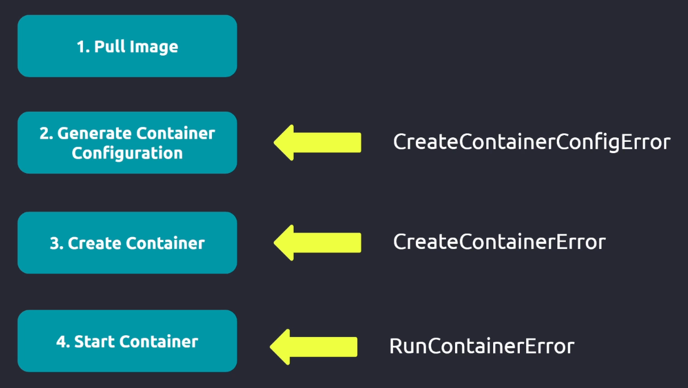

Основные этапы создания и запуска контейнера в K8s, а также присущие этим этапам ошибки:

 

`CreateContainerError` - причина может быть в том, что не задана инструкция  `ENTRYPOINT`/`CMD` в самом образе, либо не заданы параметры `command`/`args` в манифесте объекта K8s.

`RunContainerError` - причина может быть в том, что при старте контейнера исполняемый файл/команда не найдена в PATH.