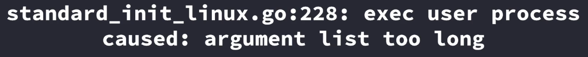

При тестировании приложения в `development` namespace оно прекрасно работало, при переносе в `production` namespace появилась ошибка `CrashLoopBackOff`.

 

Ошибка означает, что список переменных окружения в контейнере слишком большой.

 