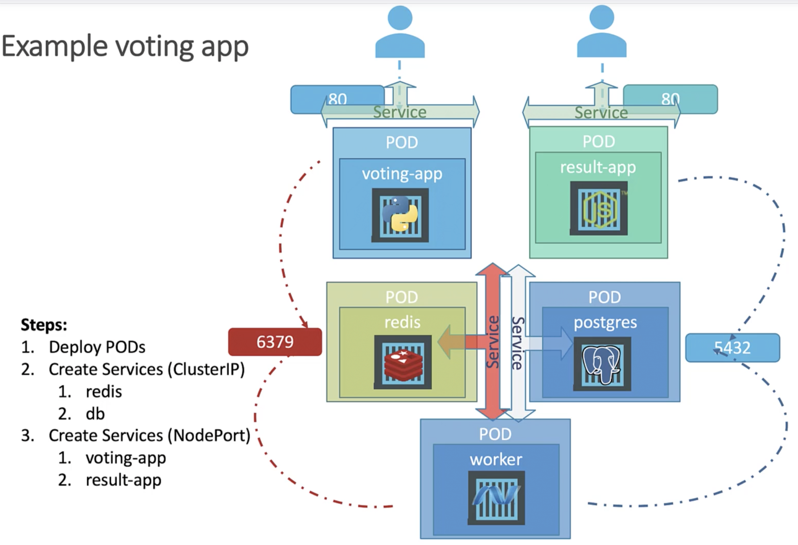

 

пользователь подключается к pod-у voting-app (порт 80)

pod voting-app подключается к pod-у redis (порт 6379)

pod worker подключается к pod-у redis (порт 6379) и к pod-у postgres (порт 5432)

pod result-app подключается к pod-у postgres (порт 5432)

пользователь подключается к pod-у result-app (порт 80)

## Итого:
к redis подключаются voting-app и worker

к postgres подключаются result-app и worker

конечные пользователи подключаются к voting-app и result-app

большинство компонентов имеют доступ к другим компонентам, исключение составляет worker (к нему никто не подключаются, только он сам подключается к redis и postgres)

мы должны создать Service для доступа к redis и назвать его также "redis", т.к. это имя "захардкожено" для подключения в приложениях voting-app и worker

эти сервисы не должны быть доступны извне кластера, поэтому мы зададим тип ClusterIP для нашего Service

также мы должны создать Service для доступа к postgres и назвать его "db", т.к. это имя "захардкожено" для подключения в приложениях result-app и worker

при подключения к postgres приложения result-app и worker передают данные для авторизации в БД - postgres:postgres

мы должны создать два Service типа NodePort для voting-app и result-app для доступа к нашим приложениям извне кластера
