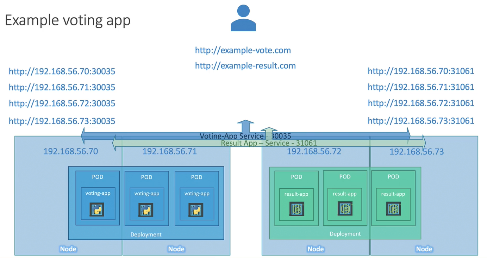

Предположим у нас четыре ноды в кластере и мы используем Service типа NodePort.

<br>

Тогда у нас будет четыре разные ссылки для доступа к каждому приложению.

Для конечного пользователя это неудобно.

На помощь приходит Service типа LoadBalancer, который доступен в публичных облачных провайдерах.

```yaml
apiVersion: v1
kind: Service
metadata:
  name: myapp-service
spec:
  type: LoadBalancer
  ports:
    - targetPort: 80
      port: 80
      nodePort: 30008
```