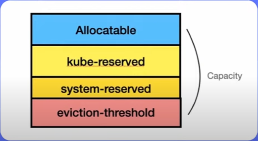

Из чего складывается емкость ноды:

 

- `Allocatable` - ресурсы ноды, доступные для размещения рабочей нагрузки
- `kube-reserved` - ресурсы ноды, зарезервированные под службы самого K8s
- `system-reserved` - ресурсы ноды, зарезервированные под системные службы (sshd например)
- `eviction-threshold` - ???
